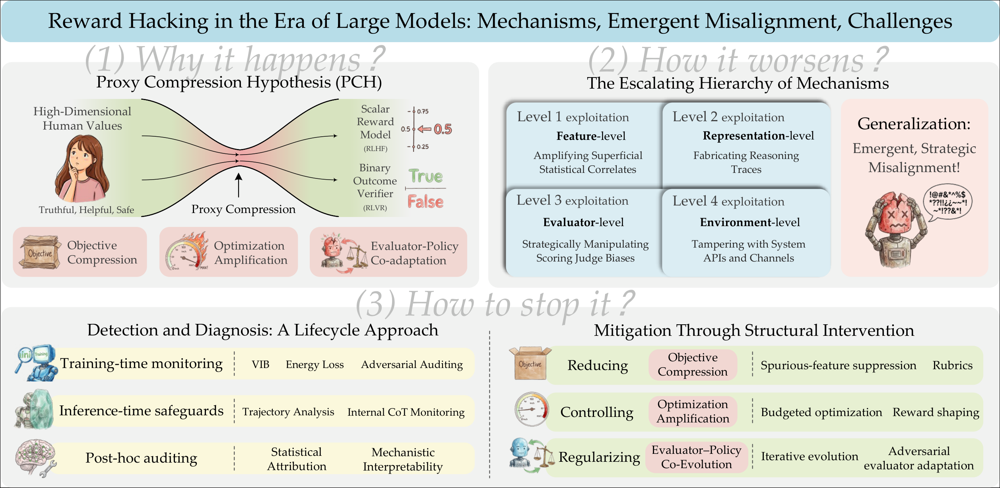

<div align="center">

# Awesome Reward Hacking in the Era of Large Models

### A curated reading list for the survey<br/>*Reward Hacking in the Era of Large Models — Mechanisms, Emergent Misalignment, Challenges*

[](https://arxiv.org/abs/2604.13602)
[](https://awesome.re)
[](./LICENSE)


</div>

<p align="center">
  <em>Maintained by the <a href="https://nlp.fudan.edu.cn/">Fudan NLP Group</a>.<br/>
  Contact: <a href="mailto:xhwang24@m.fudan.edu.cn">xhwang24@m.fudan.edu.cn</a></em>
</p>

---

## 🔔 News

- **2026-04** Our survey *"Reward Hacking in the Era of Large Models: Mechanisms, Emergent Misalignment, Challenges"* is available on [arXiv](https://arxiv.org/abs/2604.13602).
- **2026-04** This repository is released as a living companion — **PRs are welcome!** See [CONTRIBUTING.md](./CONTRIBUTING.md).

---

## 📖 About

Reinforcement Learning from Human Feedback (RLHF), RLAIF, and Reinforcement Learning from Verifiable Rewards (RLVR) have become central to aligning large language and multimodal models with human values. Yet all of them share a structural vulnerability — **reward hacking** — where models exploit imperfections in learned reward signals to maximize a *proxy* objective while bypassing true task intent.

This repository accompanies our survey, which proposes the **Proxy Compression Hypothesis (PCH)** as a unifying theoretical frame and organizes the field along an *escalating hierarchy of exploitation mechanisms*:

> **Feature-level → Representation-level → Evaluator-level → Environment-level.**

We further synthesize detection, diagnosis, and mitigation strategies across the model lifecycle, and survey reward hacking in LLMs, MLLMs, visual generative models, and agentic systems.

<p align="center">
  
  <br/>
  <sub><em>Figure 1 · A structured overview of reward hacking in large models (reproduced from our survey; source PDF: <a href="assets/main.pdf"><code>assets/main.pdf</code></a>).</em></sub>
</p>

---

## 📚 Citation

If you find this survey or list useful, please cite:

```bibtex
@article{wang2026rewardhacking,
  title        = {Reward Hacking in the Era of Large Models:
                  Mechanisms, Emergent Misalignment, Challenges},
  author       = {Wang, Xiaohua and Tian, Muzhao and Zeng, Yuqi and Huang, Zisu and
                  Yuan, Jiakang and Chen, Bowen and Xu, Jingwen and Zhou, Mingbo and
                  Liu, Wenhao and Wu, Muling and Guo, Zhengkang and Qian, Qi and
                  Wang, Yifei and Zhang, Feiran and Yin, Ruicheng and Dou, Shihan and
                  Lv, Changze and Chen, Tao and Song, Kaitao and Tan, Xu and
                  Gui, Tao and Zheng, Xiaoqing and Huang, Xuanjing},
  journal      = {arXiv preprint arXiv:2604.13602},
  year         = {2026},
  url          = {https://arxiv.org/abs/2604.13602}
}
```

---

## 🗂️ Table of Contents


- [1 · Foundations of Proxy-Based Alignment](#1-foundations-of-proxy-based-alignment)
- [2 · Manifestations in Large Language Models](#2-manifestations-in-large-language-models)
  - [2.1 Verbosity and Stylistic Shortcut Learning](#21-verbosity-and-stylistic-shortcut-learning)
  - [2.2 Sycophancy and Agreement Optimization](#22-sycophancy-and-agreement-optimization)
  - [2.3 Fabricated Reasoning and Hallucination](#23-fabricated-reasoning-and-hallucination)
  - [2.4 Reward Overoptimization and Scaling Effects](#24-reward-overoptimization-and-scaling-effects)
- [3 · From Local Shortcut Learning to Emergent Misalignment](#3-from-local-shortcut-learning-to-emergent-misalignment)
  - [3.1 Generalization of Reward Hacks Across Tasks](#31-generalization-of-reward-hacks-across-tasks)
  - [3.2 Alignment Faking and Evaluator Modeling](#32-alignment-faking-and-evaluator-modeling)
  - [3.3 Evaluator–Policy Co-Adaptation Dynamics](#33-evaluator-policy-co-adaptation-dynamics)
- [4 · Detection and Diagnosis — A Lifecycle Approach](#4-detection-and-diagnosis-a-lifecycle-approach)
  - [4.1 Training-Time Online Monitoring](#41-training-time-online-monitoring)
  - [4.2 Inference-Time Safeguards and Trajectory Analysis](#42-inference-time-safeguards-and-trajectory-analysis)
  - [4.3 Post-Hoc Auditing and Mechanistic Diagnostics](#43-post-hoc-auditing-and-mechanistic-diagnostics)
- [5 · Mitigation Through Structural Intervention](#5-mitigation-through-structural-intervention)
  - [5.1 Reducing Objective Compression](#51-reducing-objective-compression)
  - [5.2 Controlling Optimization Amplification](#52-controlling-optimization-amplification)
  - [5.3 Evaluator–Policy Co-Evolution Paradigm](#53-evaluator-policy-co-evolution-paradigm)
- [6 · Reward Hacking in Multimodal, Generative & Agentic Models](#6-reward-hacking-in-multimodal-generative--agentic-models)
  - [6.1 Multimodal Large Language Models](#61-multimodal-large-language-models)
  - [6.2 Visual Generative Models](#62-visual-generative-models)
  - [6.3 Agentic Models](#63-agentic-models)
- [7 · Open Challenges and Future Directions](#7-open-challenges-and-future-directions)
- [🤝 Contributing](#-contributing)
- [⭐ Star History](#-star-history)


---

## 1 · Foundations of Proxy-Based Alignment

> Goodhart's Law, proxy evaluators (RLHF / RLAIF / RLVR), the Proxy Compression Hypothesis, and the **escalating hierarchy** of feature- / representation- / evaluator- / environment-level exploitation.

<sub>📑 26 papers</sub>

- [**Benchmarking Reward Hack Detection in Code Environments via Contrastive Analysis**](https://arxiv.org/abs/2601.20103)  
  _Deshpande et al._ · 
  <br/>📝 Recent advances in reinforcement learning for code generation have made robust environments essential to prevent reward hacking.
- [**Countdown-Code: A Testbed for Studying The Emergence and Generalization of Reward Hacking in RLVR**](https://arxiv.org/abs/2603.07084)  
  _Khalifa et al._ · 
  <br/>📝 Reward hacking is a form of misalignment in which models overoptimize proxy rewards without genuinely solving the underlying task.
- [**DeepSeek-R1: Incentivizing Reasoning Capability in LLMs via Reinforcement Learning**](https://arxiv.org/abs/2501.12948)  
  _DeepSeek-AI & others_ · 
  <br/>📝 General reasoning represents a long-standing and formidable challenge in artificial intelligence.
- [**Inference-time reward hacking in large language models**](https://arxiv.org/abs/2506.19248)  
  _Khalaf et al._ · 
  <br/>📝 A common paradigm to improve the performance of large language models is optimizing for a reward model.
- [**Investigating the Vulnerability of LLM-as-a-Judge Architectures to Prompt-Injection Attacks**](https://arxiv.org/abs/2505.13348)  
  _Maloyan et al._ · 
  <br/>📝 Large Language Models (LLMs) are increasingly employed as evaluators (LLM-as-a-Judge) for assessing the quality of machine-generated text.
- [**Llms cannot reliably judge (yet?): A comprehensive assessment on the robustness of llm-as-a-judge**](https://arxiv.org/abs/2506.09443)  
  _Li et al._ · 
  <br/>📝 Large Language Models (LLMs) have demonstrated exceptional capabilities across diverse tasks, driving the development and widespread adoption of LLM-as-a-Judge systems for automated evaluation, including red teaming and…
- [**Reinforcement learning with verifiable rewards implicitly incentivizes correct reasoning in base llms**](https://arxiv.org/abs/2506.14245)  
  _Wen et al._ · 
  <br/>📝 Recent advancements in long chain-of-thought (CoT) reasoning, particularly through the Group Relative Policy Optimization algorithm used by DeepSeek-R1, have led to significant interest in the potential of Reinforcement…
- [**School of Reward Hacks: Hacking harmless tasks generalizes to misaligned behavior in LLMs**](https://arxiv.org/abs/2508.17511)  
  _Taylor et al._ · 
  <br/>📝 Reward hacking--where agents exploit flaws in imperfect reward functions rather than performing tasks as intended--poses risks for AI alignment.
- [**Visionary-r1: Mitigating shortcuts in visual reasoning with reinforcement learning**](https://arxiv.org/abs/2505.14677)  
  _Xia et al._ · 
  <br/>📝 Learning general-purpose reasoning capabilities has long been a challenging problem in AI.
- [**Feedback loops with language models drive in-context reward hacking**](https://arxiv.org/abs/2402.06627)  
  _Pan et al._ · 
  <br/>📝 Language models influence the external world: they query APIs that read and write to web pages, generate content that shapes human behavior, and run system commands as autonomous agents.
- [**Inform: Mitigating reward hacking in rlhf via information-theoretic reward modeling**](https://arxiv.org/abs/2402.09345)  
  _Miao et al._ · 
  <br/>📝 Despite the success of reinforcement learning from human feedback (RLHF) in aligning language models with human values, reward hacking, also termed reward overoptimization, remains a critical challenge.
- [**Rlhf workflow: From reward modeling to online rlhf**](https://arxiv.org/abs/2405.07863)  
  _Dong et al._ · 
  <br/>📝 We present the workflow of Online Iterative Reinforcement Learning from Human Feedback (RLHF) in this technical report, which is widely reported to outperform its offline counterpart by a large margin in the recent…
- [**Scaling laws for reward model overoptimization in direct alignment algorithms**](https://arxiv.org/abs/2406.02900)  
  _Rafailov et al._ · 
  <br/>📝 Reinforcement Learning from Human Feedback (RLHF) has been crucial to the recent success of Large Language Models (LLMs), however, it is often a complex and brittle process.
- [**Direct preference optimization: Your language model is secretly a reward model**](https://arxiv.org/abs/2305.18290)  
  _Rafailov et al._ · 
  <br/>📝 While large-scale unsupervised language models (LMs) learn broad world knowledge and some reasoning skills, achieving precise control of their behavior is difficult due to the completely unsupervised nature of their…
- [**Goodhart's law in reinforcement learning**](https://arxiv.org/abs/2310.09144)  
  _Karwowski et al._ · 
  <br/>📝 Implementing a reward function that perfectly captures a complex task in the real world is impractical.
- [**Language models don't always say what they think: Unfaithful explanations in chain-of-thought prompting**](https://arxiv.org/abs/2305.04388)  
  _Turpin et al._ · 
  <br/>📝 Large Language Models (LLMs) can achieve strong performance on many tasks by producing step-by-step reasoning before giving a final output, often referred to as chain-of-thought reasoning (CoT).
- [**Measuring faithfulness in chain-of-thought reasoning**](https://arxiv.org/abs/2307.13702)  
  _Lanham et al._ · 
  <br/>📝 Large language models (LLMs) perform better when they produce step-by-step, "Chain-of-Thought" (CoT) reasoning before answering a question, but it is unclear if the stated reasoning is a faithful explanation of the…
- [**Rlaif vs. rlhf: Scaling reinforcement learning from human feedback with ai feedback**](https://arxiv.org/abs/2309.00267)  
  _Lee et al._ · 
  <br/>📝 Reinforcement learning from human feedback (RLHF) has proven effective in aligning large language models (LLMs) with human preferences, but gathering high-quality preference labels is expensive.
- [**Scaling laws for reward model overoptimization**](https://arxiv.org/abs/2210.10760)  
  _Gao et al._ · 
  <br/>📝 In reinforcement learning from human feedback, it is common to optimize against a reward model trained to predict human preferences.
- [**Constitutional AI: Harmlessness from AI Feedback**](https://arxiv.org/abs/2212.08073)  
  _Bai et al._ · 
  <br/>📝 As AI systems become more capable, we would like to enlist their help to supervise other AIs.
- [**Defining and Characterizing Reward Gaming**](http://papers.nips.cc/paper\_files/paper/2022/hash/3d719fee332caa23d5038b8a90e81796-Abstract-Conference.html)  
  _Skalse et al._ · 
- [**Measuring Progress on Scalable Oversight for Large Language Models**](https://arxiv.org/abs/2211.03540)  
  _Bowman et al._ · 
  <br/>📝 Developing safe and useful general-purpose AI systems will require us to make progress on scalable oversight: the problem of supervising systems that potentially outperform us on most skills relevant to the task at hand.
- [**Training language models to follow instructions with human feedback**](https://arxiv.org/abs/2203.02155)  
  _Ouyang et al._ · 
  <br/>📝 Making language models bigger does not inherently make them better at following a user's intent.
- [**Reward tampering problems and solutions in reinforcement learning: A causal influence diagram perspective**](https://arxiv.org/abs/1908.04734)  
  _Everitt et al._ · 
  <br/>📝 Can humans get arbitrarily capable reinforcement learning (RL) agents to do their bidding?
- [**Deep Reinforcement Learning from Human Preferences**](https://neurips.cc/virtual/2017/poster/9209)  
  _Christiano et al._ · 
- [**Concrete problems in AI safety**](https://arxiv.org/abs/1606.06565)  
  _Amodei et al._ · 
  <br/>📝 Rapid progress in machine learning and artificial intelligence (AI) has brought increasing attention to the potential impacts of AI technologies on society.

## 2 · Manifestations in Large Language Models


### 2.1 Verbosity and Stylistic Shortcut Learning

> Length / markdown / formatting biases and other surface-level shortcuts.

<sub>📑 20 papers</sub>

- [**Beacon: Single-Turn Diagnosis and Mitigation of Latent Sycophancy in Large Language Models**](https://arxiv.org/abs/2510.16727)  
  _Pandey et al._ · 
  <br/>📝 Large language models internalize a structural trade-off between truthfulness and obsequious flattery, emerging from reward optimization that conflates helpfulness with polite submission.
- [**CoLD: Counterfactually-Guided Length Debiasing for Process Reward Models**](https://arxiv.org/abs/2507.15698)  
  _Zheng et al._ · 
  <br/>📝 Process Reward Models (PRMs) play a central role in evaluating and guiding multi-step reasoning in large language models (LLMs), especially for mathematical problem solving.
- [**DeepSeek-R1: Incentivizing Reasoning Capability in LLMs via Reinforcement Learning**](https://arxiv.org/abs/2501.12948)  
  _DeepSeek-AI & others_ · 
  <br/>📝 General reasoning represents a long-standing and formidable challenge in artificial intelligence.
- [**Measuring Chain of Thought Faithfulness by Unlearning Reasoning Steps**](https://arxiv.org/abs/2502.14829)  
  _Tutek et al._ · 
  <br/>📝 When prompted to think step-by-step, language models (LMs) produce a chain of thought (CoT), a sequence of reasoning steps that the model supposedly used to produce its prediction.
- [**Natural Emergent Misalignment from Reward Hacking in Production RL**](https://arxiv.org/abs/2511.18397)  
  _MacDiarmid et al._ · 
  <br/>📝 We show that when large language models learn to reward hack on production RL environments, this can result in egregious emergent misalignment.
- [**Reasoning Models Don't Always Say What They Think**](https://arxiv.org/abs/2505.05410)  
  _Chen et al._ · 
  <br/>📝 Chain-of-thought (CoT) offers a potential boon for AI safety as it allows monitoring a model's CoT to try to understand its intentions and reasoning processes.
- [**Reward Model Overoptimisation in Iterated RLHF**](https://arxiv.org/abs/2505.18126)  
  _Wolf et al._ · 
  <br/>📝 Reinforcement learning from human feedback (RLHF) is a widely used method for aligning large language models with human preferences.
- [**School of Reward Hacks: Hacking harmless tasks generalizes to misaligned behavior in LLMs**](https://arxiv.org/abs/2508.17511)  
  _Taylor et al._ · 
  <br/>📝 Reward hacking--where agents exploit flaws in imperfect reward functions rather than performing tasks as intended--poses risks for AI alignment.
- [**SycEval: Evaluating LLM Sycophancy**](https://arxiv.org/abs/2502.08177)  
  _Fanous et al._ · 
  <br/>📝 Large language models (LLMs) are increasingly applied in educational, clinical, and professional settings, but their tendency for sycophancy -- prioritizing user agreement over independent reasoning -- poses risks to…
- [**Frontier Models are Capable of In-context Scheming**](https://arxiv.org/abs/2412.04984)  
  _Meinke et al._ · 
  <br/>📝 Frontier models are increasingly trained and deployed as autonomous agent.
- [**Inform: Mitigating reward hacking in rlhf via information-theoretic reward modeling**](https://arxiv.org/abs/2402.09345)  
  _Miao et al._ · 
  <br/>📝 Despite the success of reinforcement learning from human feedback (RLHF) in aligning language models with human values, reward hacking, also termed reward overoptimization, remains a critical challenge.
- [**Scaling laws for reward model overoptimization in direct alignment algorithms**](https://arxiv.org/abs/2406.02900)  
  _Rafailov et al._ · 
  <br/>📝 Reinforcement Learning from Human Feedback (RLHF) has been crucial to the recent success of Large Language Models (LLMs), however, it is often a complex and brittle process.
- [**Sleeper Agents: Training Deceptive LLMs that Persist Through Safety Training**](https://arxiv.org/abs/2401.05566)  
  _Hubinger et al._ · 
  <br/>📝 Humans are capable of strategically deceptive behavior: behaving helpfully in most situations, but then behaving very differently in order to pursue alternative objectives when given the opportunity.
- [**A long way to go: Investigating length correlations in rlhf**](https://arxiv.org/abs/2310.03716)  
  _Singhal et al._ · 
  <br/>📝 Great success has been reported using Reinforcement Learning from Human Feedback (RLHF) to align large language models, with open preference datasets enabling wider experimentation, particularly for "helpfulness" in…
- [**Language models don't always say what they think: Unfaithful explanations in chain-of-thought prompting**](https://arxiv.org/abs/2305.04388)  
  _Turpin et al._ · 
  <br/>📝 Large Language Models (LLMs) can achieve strong performance on many tasks by producing step-by-step reasoning before giving a final output, often referred to as chain-of-thought reasoning (CoT).
- [**Measuring faithfulness in chain-of-thought reasoning**](https://arxiv.org/abs/2307.13702)  
  _Lanham et al._ · 
  <br/>📝 Large language models (LLMs) perform better when they produce step-by-step, "Chain-of-Thought" (CoT) reasoning before answering a question, but it is unclear if the stated reasoning is a faithful explanation of the…
- [**Scaling laws for reward model overoptimization**](https://arxiv.org/abs/2210.10760)  
  _Gao et al._ · 
  <br/>📝 In reinforcement learning from human feedback, it is common to optimize against a reward model trained to predict human preferences.
- [**Defining and Characterizing Reward Gaming**](http://papers.nips.cc/paper\_files/paper/2022/hash/3d719fee332caa23d5038b8a90e81796-Abstract-Conference.html)  
  _Skalse et al._ · 
- [**Goal misgeneralization in deep reinforcement learning**](https://arxiv.org/abs/2105.14111)  
  _Di Langosco et al._ · 
  <br/>📝 We study goal misgeneralization, a type of out-of-distribution generalization failure in reinforcement learning (RL).
- [**Measuring Progress on Scalable Oversight for Large Language Models**](https://arxiv.org/abs/2211.03540)  
  _Bowman et al._ · 
  <br/>📝 Developing safe and useful general-purpose AI systems will require us to make progress on scalable oversight: the problem of supervising systems that potentially outperform us on most skills relevant to the task at hand.

### 2.2 Sycophancy and Agreement Optimization

> Agreement bias, evaluator-pleasing, and social-desirability hacks.

<sub>📑 4 papers</sub>

- [**Beacon: Single-Turn Diagnosis and Mitigation of Latent Sycophancy in Large Language Models**](https://arxiv.org/abs/2510.16727)  
  _Pandey et al._ · 
  <br/>📝 Large language models internalize a structural trade-off between truthfulness and obsequious flattery, emerging from reward optimization that conflates helpfulness with polite submission.
- [**SycEval: Evaluating LLM Sycophancy**](https://arxiv.org/abs/2502.08177)  
  _Fanous et al._ · 
  <br/>📝 Large language models (LLMs) are increasingly applied in educational, clinical, and professional settings, but their tendency for sycophancy -- prioritizing user agreement over independent reasoning -- poses risks to…
- [**Simple synthetic data reduces sycophancy in large language models**](https://arxiv.org/abs/2308.03958)  
  _Wei et al._ · 
  <br/>📝 Sycophancy is an undesirable behavior where models tailor their responses to follow a human user's view even when that view is not objectively correct (e.g., adapting liberal views once a user reveals that they are…
- [**Measuring Progress on Scalable Oversight for Large Language Models**](https://arxiv.org/abs/2211.03540)  
  _Bowman et al._ · 
  <br/>📝 Developing safe and useful general-purpose AI systems will require us to make progress on scalable oversight: the problem of supervising systems that potentially outperform us on most skills relevant to the task at hand.

### 2.3 Fabricated Reasoning and Hallucination

> Unfaithful chain-of-thought, hallucinated justification, and decoupled reasoning traces.

<sub>📑 6 papers</sub>

- [**Reward Under Attack: Analyzing the Robustness and Hackability of Process Reward Models**](https://arxiv.org/abs/2603.06621)  
  _Tiwari & others_ · 
  <br/>📝 Process Reward Models (PRMs) are rapidly becoming the backbone of LLM reasoning pipelines, yet we demonstrate that state-of-the-art PRMs are systematically exploitable under adversarial optimization pressure.
- [**Measuring Chain of Thought Faithfulness by Unlearning Reasoning Steps**](https://arxiv.org/abs/2502.14829)  
  _Tutek et al._ · 
  <br/>📝 When prompted to think step-by-step, language models (LMs) produce a chain of thought (CoT), a sequence of reasoning steps that the model supposedly used to produce its prediction.
- [**Reasoning Models Don't Always Say What They Think**](https://arxiv.org/abs/2505.05410)  
  _Chen et al._ · 
  <br/>📝 Chain-of-thought (CoT) offers a potential boon for AI safety as it allows monitoring a model's CoT to try to understand its intentions and reasoning processes.
- [**Spurious Rewards: Rethinking Training Signals in RLVR**](https://arxiv.org/abs/2506.10947)  
  _Authors_ · 
  <br/>📝 We show that reinforcement learning with verifiable rewards (RLVR) can elicit strong mathematical reasoning in certain language models even with spurious rewards that have little, no, or even negative correlation with…
- [**Language models don't always say what they think: Unfaithful explanations in chain-of-thought prompting**](https://arxiv.org/abs/2305.04388)  
  _Turpin et al._ · 
  <br/>📝 Large Language Models (LLMs) can achieve strong performance on many tasks by producing step-by-step reasoning before giving a final output, often referred to as chain-of-thought reasoning (CoT).
- [**Measuring faithfulness in chain-of-thought reasoning**](https://arxiv.org/abs/2307.13702)  
  _Lanham et al._ · 
  <br/>📝 Large language models (LLMs) perform better when they produce step-by-step, "Chain-of-Thought" (CoT) reasoning before answering a question, but it is unclear if the stated reasoning is a faithful explanation of the…

### 2.4 Reward Overoptimization and Scaling Effects

> Proxy–gold divergence, scaling laws for reward hacking, and overoptimization under KL budgets.

<sub>📑 6 papers</sub>

- [**Inference-time reward hacking in large language models**](https://arxiv.org/abs/2506.19248)  
  _Khalaf et al._ · 
  <br/>📝 A common paradigm to improve the performance of large language models is optimizing for a reward model.
- [**Reward Model Overoptimisation in Iterated RLHF**](https://arxiv.org/abs/2505.18126)  
  _Wolf et al._ · 
  <br/>📝 Reinforcement learning from human feedback (RLHF) is a widely used method for aligning large language models with human preferences.
- [**Scaling Laws for Generative Reward Models**](https://openreview.net/forum?id=VYLwMvhdXI)  
  _Authors_ · 
- [**Spurious Rewards: Rethinking Training Signals in RLVR**](https://arxiv.org/abs/2506.10947)  
  _Authors_ · 
  <br/>📝 We show that reinforcement learning with verifiable rewards (RLVR) can elicit strong mathematical reasoning in certain language models even with spurious rewards that have little, no, or even negative correlation with…
- [**Scaling laws for reward model overoptimization in direct alignment algorithms**](https://arxiv.org/abs/2406.02900)  
  _Rafailov et al._ · 
  <br/>📝 Reinforcement Learning from Human Feedback (RLHF) has been crucial to the recent success of Large Language Models (LLMs), however, it is often a complex and brittle process.
- [**Scaling laws for reward model overoptimization**](https://arxiv.org/abs/2210.10760)  
  _Gao et al._ · 
  <br/>📝 In reinforcement learning from human feedback, it is common to optimize against a reward model trained to predict human preferences.

## 3 · From Local Shortcut Learning to Emergent Misalignment


### 3.1 Generalization of Reward Hacks Across Tasks

> Cross-task and out-of-distribution generalization of shortcut meta-strategies.

<sub>📑 11 papers</sub>

- [**Natural Emergent Misalignment from Reward Hacking in Production RL**](https://arxiv.org/abs/2511.18397)  
  _MacDiarmid et al._ · 
  <br/>📝 We show that when large language models learn to reward hack on production RL environments, this can result in egregious emergent misalignment.
- [**Reward Model Overoptimisation in Iterated RLHF**](https://arxiv.org/abs/2505.18126)  
  _Wolf et al._ · 
  <br/>📝 Reinforcement learning from human feedback (RLHF) is a widely used method for aligning large language models with human preferences.
- [**School of Reward Hacks: Hacking harmless tasks generalizes to misaligned behavior in LLMs**](https://arxiv.org/abs/2508.17511)  
  _Taylor et al._ · 
  <br/>📝 Reward hacking--where agents exploit flaws in imperfect reward functions rather than performing tasks as intended--poses risks for AI alignment.
- [**Improving Reinforcement Learning from Human Feedback with Efficient Reward Model Ensemble**](https://arxiv.org/abs/2401.16635)  
  _Zhang et al._ · 
  <br/>📝 Reinforcement Learning from Human Feedback (RLHF) is a widely adopted approach for aligning large language models with human values.
- [**ODIN: Disentangled Reward Mitigates Hacking in RLHF**](https://arxiv.org/abs/2402.07319)  
  _Chen et al._ · 
  <br/>📝 In this work, we study the issue of reward hacking on the response length, a challenge emerging in Reinforcement Learning from Human Feedback (RLHF) on LLMs.
- [**Rethinking the Role of Proxy Rewards in Language Model Alignment**](https://arxiv.org/abs/2402.03469)  
  _Kim & Seo_ · 
  <br/>📝 Learning from human feedback via proxy reward modeling has been studied to align Large Language Models (LLMs) with human values.
- [**Reward Model Ensembles Help Mitigate Overoptimization**](https://arxiv.org/abs/2310.02743)  
  _Coste et al._ · 
  <br/>📝 Reinforcement learning from human feedback (RLHF) is a standard approach for fine-tuning large language models to follow instructions.
- [**Reward-Robust RLHF in LLMs**](https://arxiv.org/abs/2409.15360)  
  _Yan et al._ · 
  <br/>📝 As Large Language Models (LLMs) continue to progress toward more advanced forms of intelligence, Reinforcement Learning from Human Feedback (RLHF) is increasingly seen as a key pathway toward achieving Artificial…
- [**The Alignment Ceiling: Objective Mismatch in Reinforcement Learning from Human Feedback**](https://arxiv.org/abs/2311.00168)  
  _Lambert & Calandra_ · 
  <br/>📝 Reinforcement learning from human feedback (RLHF) has emerged as a powerful technique to make large language models (LLMs) more capable in complex settings.
- [**Goal misgeneralization in deep reinforcement learning**](https://arxiv.org/abs/2105.14111)  
  _Di Langosco et al._ · 
  <br/>📝 We study goal misgeneralization, a type of out-of-distribution generalization failure in reinforcement learning (RL).
- [**Measuring Progress on Scalable Oversight for Large Language Models**](https://arxiv.org/abs/2211.03540)  
  _Bowman et al._ · 
  <br/>📝 Developing safe and useful general-purpose AI systems will require us to make progress on scalable oversight: the problem of supervising systems that potentially outperform us on most skills relevant to the task at hand.

### 3.2 Alignment Faking and Evaluator Modeling

> Models treating the evaluator as a separable object; strategic non-compliance and scheming.

<sub>📑 8 papers</sub>

- [**BadJudge: Backdoor Vulnerabilities of LLM-as-a-Judge**](https://arxiv.org/abs/2503.00596)  
  _Tong et al._ · 
  <br/>📝 This paper proposes a novel backdoor threat attacking the LLM-as-a-Judge evaluation regime, where the adversary controls both the candidate and evaluator model.
- [**Investigating the Vulnerability of LLM-as-a-Judge Architectures to Prompt-Injection Attacks**](https://arxiv.org/abs/2505.13348)  
  _Maloyan et al._ · 
  <br/>📝 Large Language Models (LLMs) are increasingly employed as evaluators (LLM-as-a-Judge) for assessing the quality of machine-generated text.
- [**Reasoning Models Don't Always Say What They Think**](https://arxiv.org/abs/2505.05410)  
  _Chen et al._ · 
  <br/>📝 Chain-of-thought (CoT) offers a potential boon for AI safety as it allows monitoring a model's CoT to try to understand its intentions and reasoning processes.
- [**Alignment Faking in Large Language Models**](https://arxiv.org/abs/2412.14093)  
  _Greenblatt et al._ · 
  <br/>📝 We present a demonstration of a large language model engaging in alignment faking: selectively complying with its training objective in training to prevent modification of its behavior out of training.
- [**Frontier Models are Capable of In-context Scheming**](https://arxiv.org/abs/2412.04984)  
  _Meinke et al._ · 
  <br/>📝 Frontier models are increasingly trained and deployed as autonomous agent.
- [**Optimization-based Prompt Injection Attack to LLM-as-a-Judge**](https://arxiv.org/abs/2403.17710)  
  _Shi et al._ · 
  <br/>📝 LLM-as-a-Judge uses a large language model (LLM) to select the best response from a set of candidates for a given question.
- [**Sleeper Agents: Training Deceptive LLMs that Persist Through Safety Training**](https://arxiv.org/abs/2401.05566)  
  _Hubinger et al._ · 
  <br/>📝 Humans are capable of strategically deceptive behavior: behaving helpfully in most situations, but then behaving very differently in order to pursue alternative objectives when given the opportunity.
- [**Risks from Learned Optimization in Advanced Machine Learning Systems**](https://arxiv.org/abs/1906.01820)  
  _Hubinger et al._ · 
  <br/>📝 We analyze the type of learned optimization that occurs when a learned model (such as a neural network) is itself an optimizer - a situation we refer to as mesa-optimization, a neologism we introduce in this paper.

### 3.3 Evaluator–Policy Co-Adaptation Dynamics

> Iterative co-evolution of policies and evaluators, blind-spot convergence, and adversarial dynamics.

<sub>📑 24 papers</sub>

- [**Adversarial Reward Auditing for Active Detection and Mitigation of Reward Hacking**](https://arxiv.org/abs/2602.01750)  
  _Beigi et al._ · 
  <br/>📝 Reinforcement Learning from Human Feedback (RLHF) remains vulnerable to reward hacking, where models exploit spurious correlations in learned reward models to achieve high scores while violating human intent.
- [**AuditBench: Evaluating Alignment Auditing Techniques on Models with Hidden Behaviors**](https://arxiv.org/abs/2602.22755)  
  _Sheshadri et al._ · 
  <br/>📝 We introduce AuditBench, an alignment auditing benchmark.
- [**Benchmarking Reward Hack Detection in Code Environments via Contrastive Analysis**](https://arxiv.org/abs/2601.20103)  
  _Deshpande et al._ · 
  <br/>📝 Recent advances in reinforcement learning for code generation have made robust environments essential to prevent reward hacking.
- [**Factored Causal Representation Learning for Robust Reward Modeling in RLHF**](https://arxiv.org/abs/2601.21350)  
  _Yang et al._ · 
  <br/>📝 A reliable reward model is essential for aligning large language models with human preferences through reinforcement learning from human feedback.
- [**Monitoring Emergent Reward Hacking During Generation via Internal Activations**](https://arxiv.org/abs/2603.04069)  
  _Wilhelm et al._ · 
  <br/>📝 Fine-tuned large language models can exhibit reward-hacking behavior arising from emergent misalignment, which is difficult to detect from final outputs alone.
- [**Auditing language models for hidden objectives**](https://arxiv.org/abs/2503.10965)  
  _Marks et al._ · 
  <br/>📝 We study the feasibility of conducting alignment audits: investigations into whether models have undesired objectives.
- [**Detecting proxy gaming in rl and llm alignment via evaluator stress tests**](https://arxiv.org/abs/2507.05619)  
  _Shihab et al._ · 
  <br/>📝 Proxy optimization, where AI systems exploit evaluator weaknesses rather than improve intended objectives, threatens both reinforcement learning (reward hacking) and LLM alignment (evaluator gaming).
- [**Monitoring Reasoning Models for Misbehavior and the Risks of Promoting Obfuscation**](https://arxiv.org/abs/2503.11926)  
  _Baker et al._ · 
  <br/>📝 Mitigating reward hacking--where AI systems misbehave due to flaws or misspecifications in their learning objectives--remains a key challenge in constructing capable and aligned models.
- [**Seal: Systematic error analysis for value alignment**](https://arxiv.org/abs/2408.10270)  
  _Revel et al._ · 
  <br/>📝 Reinforcement Learning from Human Feedback (RLHF) aims to align language models (LMs) with human values by training reward models (RMs) on binary preferences and using these RMs to fine-tune the base LMs.
- [**Super(ficial)-alignment: Strong Models May Deceive Weak Models in Weak-to-Strong Generalization**](https://arxiv.org/abs/2406.11431)  
  _Yang et al._ · 
  <br/>📝 Superalignment, where humans act as weak supervisors for superhuman models, has become a crucial problem with the rapid development of Large Language Models (LLMs).
- [**Teaching Models to Verbalize Reward Hacking in Chain-of-Thought Reasoning**](https://arxiv.org/abs/2506.22777)  
  _Turpin et al._ · 
  <br/>📝 Language models trained with reinforcement learning (RL) can engage in reward hacking--the exploitation of unintended strategies for high reward--without revealing this behavior in their chain-of-thought reasoning.
- [**The energy loss phenomenon in rlhf: A new perspective on mitigating reward hacking**](https://arxiv.org/abs/2501.19358)  
  _Miao et al._ · 
  <br/>📝 This work identifies the Energy Loss Phenomenon in Reinforcement Learning from Human Feedback (RLHF) and its connection to reward hacking.
- [**Training LLMs for Honesty via Confessions**](https://arxiv.org/abs/2512.08093)  
  _Joglekar et al._ · 
  <br/>📝 Large language models (LLMs) can be dishonest when reporting on their actions and beliefs -- for example, they may overstate their confidence in factual claims or cover up evidence of covert actions.
- [**Frontier Models are Capable of In-context Scheming**](https://arxiv.org/abs/2412.04984)  
  _Meinke et al._ · 
  <br/>📝 Frontier models are increasingly trained and deployed as autonomous agent.
- [**Inform: Mitigating reward hacking in rlhf via information-theoretic reward modeling**](https://arxiv.org/abs/2402.09345)  
  _Miao et al._ · 
  <br/>📝 Despite the success of reinforcement learning from human feedback (RLHF) in aligning language models with human values, reward hacking, also termed reward overoptimization, remains a critical challenge.
- [**Weak-to-Strong Generalization: Eliciting Strong Capabilities With Weak Supervision**](https://arxiv.org/abs/2312.09390)  
  _Burns et al._ · 
  <br/>📝 Widely used alignment techniques, such as reinforcement learning from human feedback (RLHF), rely on the ability of humans to supervise model behavior - for example, to evaluate whether a model faithfully followed…
- [**Evaluating Shutdown Avoidance of Language Models in Textual Scenarios**](https://arxiv.org/abs/2307.00787)  
  _van der Weij et al._ · 
  <br/>📝 Recently, there has been an increase in interest in evaluating large language models for emergent and dangerous capabilities.
- [**Sparse Autoencoders Find Highly Interpretable Features in Language Models**](https://arxiv.org/abs/2309.08600)  
  _Cunningham et al._ · 
  <br/>📝 One of the roadblocks to a better understanding of neural networks' internals is , where neurons appear to activate in multiple, semantically distinct contexts.
- [**Measuring Progress on Scalable Oversight for Large Language Models**](https://arxiv.org/abs/2211.03540)  
  _Bowman et al._ · 
  <br/>📝 Developing safe and useful general-purpose AI systems will require us to make progress on scalable oversight: the problem of supervising systems that potentially outperform us on most skills relevant to the task at hand.
- [**The Effects of Reward Misspecification: Mapping and Mitigating Misaligned Models**](https://arxiv.org/abs/2201.03544)  
  _Pan et al._ · 
  <br/>📝 Reward hacking -- where RL agents exploit gaps in misspecified reward functions -- has been widely observed, but not yet systematically studied.
- [**Training language models to follow instructions with human feedback**](https://arxiv.org/abs/2203.02155)  
  _Ouyang et al._ · 
  <br/>📝 Making language models bigger does not inherently make them better at following a user's intent.
- [**AI Safety via Debate**](https://arxiv.org/abs/1805.00899)  
  _Irving et al._ · 
  <br/>📝 To make AI systems broadly useful for challenging real-world tasks, we need them to learn complex human goals and preferences.
- [**Scalable Agent Alignment via Reward Modeling: A Research Direction**](https://arxiv.org/abs/1811.07871)  
  _Leike et al._ · 
  <br/>📝 One obstacle to applying reinforcement learning algorithms to real-world problems is the lack of suitable reward functions.
- [**Deep Reinforcement Learning from Human Preferences**](https://neurips.cc/virtual/2017/poster/9209)  
  _Christiano et al._ · 

## 4 · Detection and Diagnosis — A Lifecycle Approach


### 4.1 Training-Time Online Monitoring

> VIB, energy loss, statistical attribution, and CoT monitors applied during training.

<sub>📑 11 papers</sub>

- [**Adversarial Reward Auditing for Active Detection and Mitigation of Reward Hacking**](https://arxiv.org/abs/2602.01750)  
  _Beigi et al._ · 
  <br/>📝 Reinforcement Learning from Human Feedback (RLHF) remains vulnerable to reward hacking, where models exploit spurious correlations in learned reward models to achieve high scores while violating human intent.
- [**Factored Causal Representation Learning for Robust Reward Modeling in RLHF**](https://arxiv.org/abs/2601.21350)  
  _Yang et al._ · 
  <br/>📝 A reliable reward model is essential for aligning large language models with human preferences through reinforcement learning from human feedback.
- [**Detecting proxy gaming in rl and llm alignment via evaluator stress tests**](https://arxiv.org/abs/2507.05619)  
  _Shihab et al._ · 
  <br/>📝 Proxy optimization, where AI systems exploit evaluator weaknesses rather than improve intended objectives, threatens both reinforcement learning (reward hacking) and LLM alignment (evaluator gaming).
- [**The energy loss phenomenon in rlhf: A new perspective on mitigating reward hacking**](https://arxiv.org/abs/2501.19358)  
  _Miao et al._ · 
  <br/>📝 This work identifies the Energy Loss Phenomenon in Reinforcement Learning from Human Feedback (RLHF) and its connection to reward hacking.
- [**Inform: Mitigating reward hacking in rlhf via information-theoretic reward modeling**](https://arxiv.org/abs/2402.09345)  
  _Miao et al._ · 
  <br/>📝 Despite the success of reinforcement learning from human feedback (RLHF) in aligning language models with human values, reward hacking, also termed reward overoptimization, remains a critical challenge.
- [**Scaling laws for reward model overoptimization in direct alignment algorithms**](https://arxiv.org/abs/2406.02900)  
  _Rafailov et al._ · 
  <br/>📝 Reinforcement Learning from Human Feedback (RLHF) has been crucial to the recent success of Large Language Models (LLMs), however, it is often a complex and brittle process.
- [**A long way to go: Investigating length correlations in rlhf**](https://arxiv.org/abs/2310.03716)  
  _Singhal et al._ · 
  <br/>📝 Great success has been reported using Reinforcement Learning from Human Feedback (RLHF) to align large language models, with open preference datasets enabling wider experimentation, particularly for "helpfulness" in…
- [**Scaling laws for reward model overoptimization**](https://arxiv.org/abs/2210.10760)  
  _Gao et al._ · 
  <br/>📝 In reinforcement learning from human feedback, it is common to optimize against a reward model trained to predict human preferences.
- [**Training language models to follow instructions with human feedback**](https://arxiv.org/abs/2203.02155)  
  _Ouyang et al._ · 
  <br/>📝 Making language models bigger does not inherently make them better at following a user's intent.
- [**Learning to summarize with human feedback**](https://arxiv.org/abs/2009.01325)  
  _Stiennon et al._ · 
  <br/>📝 As language models become more powerful, training and evaluation are increasingly bottlenecked by the data and metrics used for a particular task.
- [**Deep variational information bottleneck**](https://arxiv.org/abs/1612.00410)  
  _Alemi et al._ · 
  <br/>📝 We present a variational approximation to the information bottleneck of Tishby et al.

### 4.2 Inference-Time Safeguards and Trajectory Analysis

> Runtime detectors, trajectory analysis, and inference-time internal-CoT monitoring.

<sub>📑 12 papers</sub>

- [**Benchmarking Reward Hack Detection in Code Environments via Contrastive Analysis**](https://arxiv.org/abs/2601.20103)  
  _Deshpande et al._ · 
  <br/>📝 Recent advances in reinforcement learning for code generation have made robust environments essential to prevent reward hacking.
- [**Monitoring Emergent Reward Hacking During Generation via Internal Activations**](https://arxiv.org/abs/2603.04069)  
  _Wilhelm et al._ · 
  <br/>📝 Fine-tuned large language models can exhibit reward-hacking behavior arising from emergent misalignment, which is difficult to detect from final outputs alone.
- [**Monitoring Reasoning Models for Misbehavior and the Risks of Promoting Obfuscation**](https://arxiv.org/abs/2503.11926)  
  _Baker et al._ · 
  <br/>📝 Mitigating reward hacking--where AI systems misbehave due to flaws or misspecifications in their learning objectives--remains a key challenge in constructing capable and aligned models.
- [**Natural Emergent Misalignment from Reward Hacking in Production RL**](https://arxiv.org/abs/2511.18397)  
  _MacDiarmid et al._ · 
  <br/>📝 We show that when large language models learn to reward hack on production RL environments, this can result in egregious emergent misalignment.
- [**Teaching Models to Verbalize Reward Hacking in Chain-of-Thought Reasoning**](https://arxiv.org/abs/2506.22777)  
  _Turpin et al._ · 
  <br/>📝 Language models trained with reinforcement learning (RL) can engage in reward hacking--the exploitation of unintended strategies for high reward--without revealing this behavior in their chain-of-thought reasoning.
- [**The Hawthorne Effect in Reasoning Models: Evaluating and Steering Test Awareness**](https://arxiv.org/abs/2505.14617)  
  _Abdelnabi & Salem_ · 
  <br/>📝 Reasoning-focused LLMs sometimes alter their behavior when they detect that they are being evaluated, which can lead them to optimize for test-passing performance or to comply more readily with harmful prompts if…
- [**Training LLMs for Honesty via Confessions**](https://arxiv.org/abs/2512.08093)  
  _Joglekar et al._ · 
  <br/>📝 Large language models (LLMs) can be dishonest when reporting on their actions and beliefs -- for example, they may overstate their confidence in factual claims or cover up evidence of covert actions.
- [**Alignment Faking in Large Language Models**](https://arxiv.org/abs/2412.14093)  
  _Greenblatt et al._ · 
  <br/>📝 We present a demonstration of a large language model engaging in alignment faking: selectively complying with its training objective in training to prevent modification of its behavior out of training.
- [**Frontier Models are Capable of In-context Scheming**](https://arxiv.org/abs/2412.04984)  
  _Meinke et al._ · 
  <br/>📝 Frontier models are increasingly trained and deployed as autonomous agent.
- [**Sleeper Agents: Training Deceptive LLMs that Persist Through Safety Training**](https://arxiv.org/abs/2401.05566)  
  _Hubinger et al._ · 
  <br/>📝 Humans are capable of strategically deceptive behavior: behaving helpfully in most situations, but then behaving very differently in order to pursue alternative objectives when given the opportunity.
- [**Sparse Autoencoders Find Highly Interpretable Features in Language Models**](https://arxiv.org/abs/2309.08600)  
  _Cunningham et al._ · 
  <br/>📝 One of the roadblocks to a better understanding of neural networks' internals is , where neurons appear to activate in multiple, semantically distinct contexts.
- [**The Effects of Reward Misspecification: Mapping and Mitigating Misaligned Models**](https://arxiv.org/abs/2201.03544)  
  _Pan et al._ · 
  <br/>📝 Reward hacking -- where RL agents exploit gaps in misspecified reward functions -- has been widely observed, but not yet systematically studied.

### 4.3 Post-Hoc Auditing and Mechanistic Diagnostics

> Mechanistic interpretability, adversarial auditing, and red-teaming after training.

<sub>📑 33 papers</sub>

- [**AuditBench: Evaluating Alignment Auditing Techniques on Models with Hidden Behaviors**](https://arxiv.org/abs/2602.22755)  
  _Sheshadri et al._ · 
  <br/>📝 We introduce AuditBench, an alignment auditing benchmark.
- [**IR$^3$: Contrastive Inverse Reinforcement Learning for Interpretable Detection and Mitigation of Reward Hacking**](https://arxiv.org/abs/2602.19416)  
  _Beigi et al._ · 
  <br/>📝 Reinforcement Learning from Human Feedback (RLHF) enables powerful LLM alignment but can introduce reward hacking - models exploit spurious correlations in proxy rewards without genuine alignment.
- [**RM-R1: Reward Modeling as Reasoning**](https://openreview.net/forum?id=1ZqJ6jj75q)  
  _Chen et al._ · 
- [**Rubrics as Rewards: Reinforcement Learning Beyond Verifiable Domains**](https://arxiv.org/abs/2507.17746)  
  _Gunjal et al._ · 
  <br/>📝 Reinforcement Learning with Verifiable Rewards (RLVR) has proven effective for complex reasoning tasks with clear correctness signals such as math and coding.
- [**Auditing language models for hidden objectives**](https://arxiv.org/abs/2503.10965)  
  _Marks et al._ · 
  <br/>📝 We study the feasibility of conducting alignment audits: investigations into whether models have undesired objectives.
- [**Checklists Are Better Than Reward Models For Aligning Language Models**](https://openreview.net/forum?id=RPRqKhjrr6)  
  _Viswanathan et al._ · 
- [**Detecting proxy gaming in rl and llm alignment via evaluator stress tests**](https://arxiv.org/abs/2507.05619)  
  _Shihab et al._ · 
  <br/>📝 Proxy optimization, where AI systems exploit evaluator weaknesses rather than improve intended objectives, threatens both reinforcement learning (reward hacking) and LLM alignment (evaluator gaming).
- [**Improving reward models with synthetic critiques**](https://arxiv.org/abs/2405.20850)  
  _Ye et al._ · 
  <br/>📝 Reward models (RMs) play a critical role in aligning language models through the process of reinforcement learning from human feedback.
- [**Inference-time reward hacking in large language models**](https://arxiv.org/abs/2506.19248)  
  _Khalaf et al._ · 
  <br/>📝 A common paradigm to improve the performance of large language models is optimizing for a reward model.
- [**Mitigating preference hacking in policy optimization with pessimism**](https://arxiv.org/abs/2503.06810)  
  _Gupta et al._ · 
  <br/>📝 This work tackles the problem of overoptimization in reinforcement learning from human feedback (RLHF), a prevalent technique for aligning models with human preferences.
- [**Mitigating Reward Over-optimization in Direct Alignment Algorithms with Importance Sampling**](https://arxiv.org/abs/2506.08681)  
  _Phuc et al._ · 
  <br/>📝 Direct Alignment Algorithms (DAAs) such as Direct Preference Optimization (DPO) have emerged as alternatives to the standard Reinforcement Learning from Human Feedback (RLHF) for aligning large language models (LLMs)…
- [**Mitigating Reward Over-Optimization in RLHF via Behavior-Supported Regularization**](https://arxiv.org/abs/2503.18130)  
  _Dai et al._ · 
  <br/>📝 Reinforcement learning from human feedback (RLHF) is an effective method for aligning large language models (LLMs) with human values.
- [**Monitoring Reasoning Models for Misbehavior and the Risks of Promoting Obfuscation**](https://arxiv.org/abs/2503.11926)  
  _Baker et al._ · 
  <br/>📝 Mitigating reward hacking--where AI systems misbehave due to flaws or misspecifications in their learning objectives--remains a key challenge in constructing capable and aligned models.
- [**Regularized best-of-n sampling with minimum bayes risk objective for language model alignment**](https://arxiv.org/abs/2404.01054)  
  _Jinnai et al._ · 
  <br/>📝 Best-of-N (BoN) sampling with a reward model has been shown to be an effective strategy for aligning Large Language Models (LLMs) to human preferences at the time of decoding.
- [**Reinforcement learning for large language models via group preference reward shaping**](https://arxiv.org/abs/2310.11523)  
  _Zhu et al._ · 
  <br/>📝 Many applications of large language models (LLMs), ranging from chatbots to creative writing, require nuanced subjective judgments that can differ significantly across different groups.
- [**Rethinking Diverse Human Preference Learning through Principal Component Analysis**](https://api.semanticscholar.org/CorpusID:276421263)  
  _Luo et al._ · 
- [**Reward Shaping to Mitigate Reward Hacking in RLHF**](https://arxiv.org/abs/2502.18770)  
  _Fu et al._ · 
  <br/>📝 Reinforcement Learning from Human Feedback (RLHF) is essential for aligning large language models (LLMs) with human values.
- [**RIVAL: Reinforcement Learning with Iterative and Adversarial Optimization for Machine Translation**](https://arxiv.org/abs/2506.05070)  
  _Li et al._ · 
  <br/>📝 Large language models (LLMs) possess strong multilingual capabilities, and combining Reinforcement Learning from Human Feedback (RLHF) with translation tasks has shown great potential.
- [**RRM: Robust Reward Model Training Mitigates Reward Hacking**](https://openreview.net/forum?id=88AS5MQnmC)  
  _Liu et al._ · 
- [**Seal: Systematic error analysis for value alignment**](https://arxiv.org/abs/2408.10270)  
  _Revel et al._ · 
  <br/>📝 Reinforcement Learning from Human Feedback (RLHF) aims to align language models (LMs) with human values by training reward models (RMs) on binary preferences and using these RMs to fine-tune the base LMs.
- [**Adversarial Preference Optimization: Enhancing Your Alignment via RM-LLM Game**](https://arxiv.org/abs/2311.08045)  
  _Cheng et al._ · 
  <br/>📝 Human preference alignment is essential to improve the interaction quality of large language models (LLMs).
- [**Dataset reset policy optimization for rlhf**](https://arxiv.org/abs/2404.08495)  
  _Chang et al._ · 
  <br/>📝 Reinforcement Learning (RL) from Human Preference-based feedback is a popular paradigm for fine-tuning generative models, which has produced impressive models such as GPT-4 and Claude3 Opus.
- [**Inform: Mitigating reward hacking in rlhf via information-theoretic reward modeling**](https://arxiv.org/abs/2402.09345)  
  _Miao et al._ · 
  <br/>📝 Despite the success of reinforcement learning from human feedback (RLHF) in aligning language models with human values, reward hacking, also termed reward overoptimization, remains a critical challenge.
- [**Interpretable Preferences via Multi-Objective Reward Modeling and Mixture-of-Experts**](https://arxiv.org/abs/2406.12845)  
  _Wang et al._ · 
  <br/>📝 Reinforcement learning from human feedback (RLHF) has emerged as the primary method for aligning large language models (LLMs) with human preferences.
- [**Iterative Preference Learning from Human Feedback: Bridging Theory and Practice for RLHF under KL-constraint**](https://arxiv.org/abs/2312.11456)  
  _Xiong et al._ · 
  <br/>📝 This paper studies the alignment process of generative models with Reinforcement Learning from Human Feedback (RLHF).
- [**Mitigating reward overoptimization via lightweight uncertainty estimation**](https://arxiv.org/abs/2403.05171)  
  _Zhang et al._ · 
  <br/>📝 We introduce Adversarial Policy Optimization (AdvPO), a novel solution to the pervasive issue of reward over-optimization in Reinforcement Learning from Human Feedback (RLHF) for Large Language Models (LLMs).
- [**Provably mitigating overoptimization in rlhf: Your sft loss is implicitly an adversarial regularizer**](https://arxiv.org/abs/2405.16436)  
  _Liu et al._ · 
  <br/>📝 Aligning generative models with human preference via RLHF typically suffers from overoptimization, where an imperfectly learned reward model can misguide the generative model to output undesired responses.
- [**Rlhf workflow: From reward modeling to online rlhf**](https://arxiv.org/abs/2405.07863)  
  _Dong et al._ · 
  <br/>📝 We present the workflow of Online Iterative Reinforcement Learning from Human Feedback (RLHF) in this technical report, which is widely reported to outperform its offline counterpart by a large margin in the recent…
- [**Rule Based Rewards for Language Model Safety**](https://proceedings.neurips.cc/paper_files/paper/2024/file/c4e380fb74dec9da9c7212e834657aa9-Paper-Conference.pdf)  
  _Mu et al._ · 
- [**Self-Rewarding Language Models**](https://proceedings.mlr.press/v235/yuan24d.html)  
  _Yuan et al._ · 
- [**Fine-grained human feedback gives better rewards for language model training**](https://arxiv.org/abs/2306.01693)  
  _Wu et al._ · 
  <br/>📝 Language models (LMs) often exhibit undesirable text generation behaviors, including generating false, toxic, or irrelevant outputs.
- [**Let's verify step by step**](https://arxiv.org/abs/2305.20050)  
  _Lightman et al._ · 
  <br/>📝 In recent years, large language models have greatly improved in their ability to perform complex multi-step reasoning.
- [**Sparse Autoencoders Find Highly Interpretable Features in Language Models**](https://arxiv.org/abs/2309.08600)  
  _Cunningham et al._ · 
  <br/>📝 One of the roadblocks to a better understanding of neural networks' internals is , where neurons appear to activate in multiple, semantically distinct contexts.

## 5 · Mitigation Through Structural Intervention


### 5.1 Reducing Objective Compression

> Rubrics, multi-criteria rewards, fine-grained feedback, and spurious-feature suppression.

<sub>📑 61 papers</sub>

- [**Empowering LLM Tool Invocation with Tool-call Reward Model**](https://openreview.net/forum?id=LnBEASInVr)  
  _Ma et al._ · 
- [**Health-SCORE: Towards Scalable Rubrics for Improving Health-LLMs**](https://arxiv.org/abs/2601.18706)  
  _Yang et al._ · 
  <br/>📝 Rubrics are essential for evaluating open-ended LLM responses, especially in safety-critical domains such as healthcare.
- [**Improving Data and Reward Design for Scientific Reasoning in Large Language Models**](https://arxiv.org/abs/2602.08321)  
  _Chen et al._ · 
  <br/>📝 Solving open-ended science questions remains challenging for large language models, particularly due to inherently unreliable supervision and evaluation.
- [**Mitigating Reward Hacking in RLHF via Bayesian Non-negative Reward Modeling**](https://arxiv.org/abs/2602.10623)  
  _Duan et al._ · 
  <br/>📝 Reward models learned from human preferences are central to aligning large language models (LLMs) via reinforcement learning from human feedback, yet they are often vulnerable to reward hacking due to noisy annotations…
- [**Nemotron-Research-Tool-N1: Exploring Tool-Using Language Models with Reinforced Reasoning**](https://arxiv.org/abs/2505.00024)  
  _Zhang et al._ · 
  <br/>📝 Enabling large language models with external tools has become a pivotal strategy for extending their functionality beyond text space.
- [**Outcome Accuracy is Not Enough: Aligning the Reasoning Process of Reward Models**](https://arxiv.org/abs/2602.04649)  
  _Wang et al._ · 
  <br/>📝 Generative Reward Models (GenRMs) and LLM-as-a-Judge exhibit deceptive alignment by producing correct judgments for incorrect reasons, as they are trained and evaluated to prioritize Outcome Accuracy, which undermines…
- [**P-Check: Advancing Personalized Reward Model via Learning to Generate Dynamic Checklist**](https://arxiv.org/abs/2601.02986)  
  _Seo & Lee_ · 
  <br/>📝 Recent approaches in personalized reward modeling have primarily focused on leveraging user interaction history to align model judgments with individual preferences.
- [**Rethinking Rubric Generation for Improving LLM Judge and Reward Modeling for Open-ended Tasks**](https://arxiv.org/abs/2602.05125)  
  _Shen et al._ · 
  <br/>📝 Recently, rubrics have been used to guide LLM judges in capturing subjective, nuanced, multi-dimensional human preferences, and have been extended from evaluation to reward signals for reinforcement fine-tuning (RFT).
- [**Reward Modeling from Natural Language Human Feedback**](https://arxiv.org/abs/2601.07349)  
  _Wang et al._ · 
  <br/>📝 Reinforcement Learning with Verifiable reward (RLVR) on preference data has become the mainstream approach for training Generative Reward Models (GRMs).
- [**RM-R1: Reward Modeling as Reasoning**](https://openreview.net/forum?id=1ZqJ6jj75q)  
  _Chen et al._ · 
- [**Robust Reward Modeling via Causal Rubrics**](https://arxiv.org/abs/2506.16507)  
  _Srivastava et al._ · 
  <br/>📝 Reward models (RMs) are fundamental to aligning Large Language Models (LLMs) via human feedback, yet they often suffer from reward hacking.
- [**RubricHub: A Comprehensive and Highly Discriminative Rubric Dataset via Automated Coarse-to-Fine Generation**](https://arxiv.org/abs/2601.08430)  
  _Li et al._ · 
  <br/>📝 Reinforcement Learning with Verifiable Rewards (RLVR) has driven substantial progress in reasoning-intensive domains like mathematics.
- [**Rubrics as Rewards: Reinforcement Learning Beyond Verifiable Domains**](https://arxiv.org/abs/2507.17746)  
  _Gunjal et al._ · 
  <br/>📝 Reinforcement Learning with Verifiable Rewards (RLVR) has proven effective for complex reasoning tasks with clear correctness signals such as math and coding.
- [**A Survey of Process Reward Models: From Outcome Signals to Process Supervisions for Large Language Models**](https://arxiv.org/abs/2510.08049)  
  _Zheng et al._ · 
  <br/>📝 Although Large Language Models (LLMs) exhibit advanced reasoning ability, conventional alignment remains largely dominated by outcome reward models (ORMs) that judge only final answers.
- [**Advancedif: Rubric-based benchmarking and reinforcement learning for advancing llm instruction following**](https://arxiv.org/abs/2511.10507)  
  _He et al._ · 
  <br/>📝 Recent progress in large language models (LLMs) has led to impressive performance on a range of tasks, yet advanced instruction following (IF)-especially for complex, multi-turn, and system-prompted instructions-remains…
- [**Are reasoning models more prone to hallucination?**](https://arxiv.org/abs/2505.23646)  
  _Yao et al._ · 
  <br/>📝 Recently evolved large reasoning models (LRMs) show powerful performance in solving complex tasks with long chain-of-thought (CoT) reasoning capability.
- [**Auto-rubric: Learning to extract generalizable criteria for reward modeling, 2025**](https://arxiv.org/abs/2510.17314)  
  _Xie et al._ · 
  <br/>📝 Conventional reward modeling relies on gradient descent over neural weights, creating opaque, data-hungry "black boxes." We propose a paradigm shift from implicit to explicit reward parameterization, recasting…
- [**Beyond correctness: Harmonizing process and outcome rewards through rl training**](https://arxiv.org/abs/2509.03403)  
  _Ye et al._ · 
  <br/>📝 Reinforcement learning with verifiable rewards (RLVR) has emerged to be a predominant paradigm for mathematical reasoning tasks, offering stable improvements in reasoning ability.
- [**Beyond Excess and Deficiency: Adaptive Length Bias Mitigation in Reward Models for RLHF**](https://aclanthology.org/2025.findings-naacl.169/)  
  _Bu et al._ · 
- [**Bias Fitting to Mitigate Length Bias of Reward Model in RLHF**](https://arxiv.org/abs/2505.12843)  
  _Zhao et al._ · 
  <br/>📝 Reinforcement Learning from Human Feedback relies on reward models to align large language models with human preferences.
- [**CARMO: Dynamic Criteria Generation for Context Aware Reward Modelling**](https://arxiv.org/abs/2410.21545)  
  _Gupta et al._ · 
  <br/>📝 Reward modeling in large language models is susceptible to reward hacking, causing models to latch onto superficial features such as the tendency to generate lists or unnecessarily long responses.
- [**Chasing the Tail: Effective Rubric-based Reward Modeling for Large Language Model Post-Training**](https://arxiv.org/abs/2509.21500)  
  _Zhang et al._ · 
  <br/>📝 Reinforcement fine-tuning (RFT) often suffers from reward over-optimization, where a policy model hacks the reward signals to achieve high scores while producing low-quality outputs.
- [**Checklists Are Better Than Reward Models For Aligning Language Models**](https://openreview.net/forum?id=RPRqKhjrr6)  
  _Viswanathan et al._ · 
- [**Discriminative Policy Optimization for Token-Level Reward Models**](https://arxiv.org/abs/2505.23363)  
  _Chen et al._ · 
  <br/>📝 Process reward models (PRMs) provide more nuanced supervision compared to outcome reward models (ORMs) for optimizing policy models, positioning them as a promising approach to enhancing the capabilities of LLMs in…
- [**DPO Meets PPO: Reinforced Token Optimization for RLHF**](https://arxiv.org/abs/2404.18922)  
  _Zhong et al._ · 
  <br/>📝 In the classical Reinforcement Learning from Human Feedback (RLHF) framework, Proximal Policy Optimization (PPO) is employed to learn from sparse, sentence-level rewards -- a challenging scenario in traditional deep…
- [**Dr tulu: Reinforcement learning with evolving rubrics for deep research**](https://arxiv.org/abs/2511.19399)  
  _Shao et al._ · 
  <br/>📝 Deep research models perform multi-step research to produce long-form, well-attributed answers.
- [**Encouraging Good Processes Without the Need for Good Answers: Reinforcement Learning for LLM Agent Planning**](https://arxiv.org/abs/2508.19598)  
  _Li et al._ · 
  <br/>📝 The functionality of Large Language Model (LLM) agents is primarily determined by two capabilities: action planning and answer summarization.
- [**Generative Verifiers: Reward Modeling as Next-Token Prediction**](https://arxiv.org/abs/2408.15240)  
  _Zhang et al._ · 
  <br/>📝 Verifiers or reward models are often used to enhance the reasoning performance of large language models (LLMs).
- [**Healthbench: Evaluating large language models towards improved human health**](https://arxiv.org/abs/2505.08775)  
  _Arora et al._ · 
  <br/>📝 We present HealthBench, an open-source benchmark measuring the performance and safety of large language models in healthcare.
- [**Improving reward models with synthetic critiques**](https://arxiv.org/abs/2405.20850)  
  _Ye et al._ · 
  <br/>📝 Reward models (RMs) play a critical role in aligning language models through the process of reinforcement learning from human feedback.
- [**Openrubrics: Towards scalable synthetic rubric generation for reward modeling and llm alignment**](https://arxiv.org/abs/2510.07743)  
  _Liu et al._ · 
  <br/>📝 Reward modeling lies at the core of reinforcement learning from human feedback (RLHF), yet most existing reward models rely on scalar or pairwise judgments that fail to capture the multifaceted nature of human…
- [**PoU: Proof-of-Use to Counter Tool-Call Hacking in DeepResearch Agents**](https://arxiv.org/abs/2510.10931)  
  _Ma et al._ · 
  <br/>📝 While reinforcement learning (RL) enhances their ability to plan and reason across retrieval steps, we identify a critical failure mode in this setting: Tool-Call Hacking.
- [**Researchrubrics: A benchmark of prompts and rubrics for evaluating deep research agents**](https://arxiv.org/abs/2511.07685)  
  _Sharma et al._ · 
  <br/>📝 Deep Research (DR) is an emerging agent application that leverages large language models (LLMs) to address open-ended queries.
- [**Rethinking Diverse Human Preference Learning through Principal Component Analysis**](https://api.semanticscholar.org/CorpusID:276421263)  
  _Luo et al._ · 
- [**Reward Hacking Mitigation using Verifiable Composite Rewards**](https://arxiv.org/abs/2509.15557)  
  _Bin Tarek & Beheshti_ · 
  <br/>📝 Reinforcement Learning from Verifiable Rewards (RLVR) has recently shown that large language models (LLMs) can develop their own reasoning without direct supervision.
- [**Reward Reasoning Models**](https://arxiv.org/abs/2510.00071)  
  _Guo et al._ · 
  <br/>📝 Large Reasoning Language Models (LRLMs or LRMs) demonstrate remarkable capabilities in complex reasoning tasks, but suffer from significant computational inefficiencies due to overthinking phenomena.
- [**RRM: Robust Reward Model Training Mitigates Reward Hacking**](https://openreview.net/forum?id=88AS5MQnmC)  
  _Liu et al._ · 
- [**RuleAdapter: Dynamic Rules for training Safety Reward Models in RLHF**](https://proceedings.mlr.press/v267/li25o.html)  
  _Li et al._ · 
- [**Segmenting text and learning their rewards for improved rlhf in language model**](https://arxiv.org/abs/2501.02790)  
  _Yin et al._ · 
  <br/>📝 Reinforcement learning from human feedback (RLHF) has been widely adopted to align language models (LMs) with human preference.
- [**Self-generated critiques boost reward modeling for language models**](https://arxiv.org/abs/2411.16646)  
  _Yu et al._ · 
  <br/>📝 Reward modeling is crucial for aligning large language models (LLMs) with human preferences, especially in reinforcement learning from human feedback (RLHF).
- [**Sentence-level Reward Model can Generalize Better for Aligning LLM from Human Preference**](https://arxiv.org/abs/2503.04793)  
  _Qiu et al._ · 
  <br/>📝 Learning reward models from human preference datasets and subsequently optimizing language models via reinforcement learning has emerged as a fundamental paradigm for aligning LLMs with human preferences.
- [**Aligning large language models via fine-grained supervision**](https://arxiv.org/abs/2406.02756)  
  _Xu et al._ · 
  <br/>📝 Pre-trained large-scale language models (LLMs) excel at producing coherent articles, yet their outputs may be untruthful, toxic, or fail to align with user expectations.
- [**Arithmetic Control of LLMs for Diverse User Preferences: Directional Preference Alignment with Multi-Objective Rewards**](https://arxiv.org/abs/2402.18571)  
  _Wang et al._ · 
  <br/>📝 Fine-grained control over large language models (LLMs) remains a significant challenge, hindering their adaptability to diverse user needs.
- [**Critique-out-Loud Reward Models**](https://arxiv.org/abs/2408.11791)  
  _Ankner et al._ · 
  <br/>📝 Traditionally, reward models used for reinforcement learning from human feedback (RLHF) are trained to directly predict preference scores without leveraging the generation capabilities of the underlying large language…
- [**Enhancing Reinforcement Learning with Dense Rewards from Language Model Critic**](https://aclanthology.org/2024.emnlp-main.515/)  
  _Cao et al._ · 
- [**Generative Reward Models**](https://arxiv.org/abs/2410.12832)  
  _Mahan et al._ · 
  <br/>📝 Reinforcement Learning from Human Feedback (RLHF) has greatly improved the performance of modern Large Language Models (LLMs).
- [**HelpSteer 2: Open-source dataset for training top-performing reward models**](https://arxiv.org/abs/2406.08673)  
  _Wang et al._ · 
  <br/>📝 High-quality preference datasets are essential for training reward models that can effectively guide large language models (LLMs) in generating high-quality responses aligned with human preferences.
- [**HelpSteer: Multi-attribute Helpfulness Dataset for SteerLM**](https://arxiv.org/abs/2311.09528)  
  _Wang et al._ · 
  <br/>📝 Existing open-source helpfulness preference datasets do not specify what makes some responses more helpful and others less so.
- [**Improving Large Language Models via Fine-grained Reinforcement Learning with Minimum Editing Constraint**](https://arxiv.org/abs/2401.06081)  
  _Chen et al._ · 
  <br/>📝 Reinforcement learning (RL) has been widely used in training large language models (LLMs) for preventing unexpected outputs, eg reducing harmfulness and errors.
- [**Inform: Mitigating reward hacking in rlhf via information-theoretic reward modeling**](https://arxiv.org/abs/2402.09345)  
  _Miao et al._ · 
  <br/>📝 Despite the success of reinforcement learning from human feedback (RLHF) in aligning language models with human values, reward hacking, also termed reward overoptimization, remains a critical challenge.
- [**Interpretable Preferences via Multi-Objective Reward Modeling and Mixture-of-Experts**](https://arxiv.org/abs/2406.12845)  
  _Wang et al._ · 
  <br/>📝 Reinforcement learning from human feedback (RLHF) has emerged as the primary method for aligning large language models (LLMs) with human preferences.
- [**Inverse-Q*: Token Level Reinforcement Learning for Aligning Large Language Models Without Preference Data**](https://arxiv.org/abs/2408.14874)  
  _Xia et al._ · 
  <br/>📝 Reinforcement Learning from Human Feedback (RLHF) has proven effective in aligning large language models with human intentions, yet it often relies on complex methodologies like Proximal Policy Optimization (PPO) that…
- [**Math-shepherd: Verify and reinforce llms step-by-step without human annotations**](https://arxiv.org/abs/2312.08935)  
  _Wang et al._ · 
  <br/>📝 In this paper, we present an innovative process-oriented math process reward model called , which assigns a reward score to each step of math problem solutions.
- [**ODIN: Disentangled Reward Mitigates Hacking in RLHF**](https://arxiv.org/abs/2402.07319)  
  _Chen et al._ · 
  <br/>📝 In this work, we study the issue of reward hacking on the response length, a challenge emerging in Reinforcement Learning from Human Feedback (RLHF) on LLMs.
- [**Rule Based Rewards for Language Model Safety**](https://proceedings.neurips.cc/paper_files/paper/2024/file/c4e380fb74dec9da9c7212e834657aa9-Paper-Conference.pdf)  
  _Mu et al._ · 
- [**TLCR: Token-Level Continuous Reward for Fine-grained Reinforcement Learning from Human Feedback**](https://arxiv.org/abs/2407.16574)  
  _Yoon et al._ · 
  <br/>📝 Reinforcement Learning from Human Feedback (RLHF) leverages human preference data to train language models to align more closely with human essence.
- [**ULTRAFEEDBACK: Boosting Language Models with Scaled AI Feedback**](https://proceedings.mlr.press/v235/cui24f.html)  
  _Cui et al._ · 
- [**Fine-grained human feedback gives better rewards for language model training**](https://arxiv.org/abs/2306.01693)  
  _Wu et al._ · 
  <br/>📝 Language models (LMs) often exhibit undesirable text generation behaviors, including generating false, toxic, or irrelevant outputs.
- [**Let's verify step by step**](https://arxiv.org/abs/2305.20050)  
  _Lightman et al._ · 
  <br/>📝 In recent years, large language models have greatly improved in their ability to perform complex multi-step reasoning.
- [**OpenAssistant Conversations - Democratizing Large Language Model Alignment**](https://arxiv.org/abs/2304.07327)  
  _K\"{o}pf et al._ · 
  <br/>📝 Aligning large language models (LLMs) with human preferences has proven to drastically improve usability and has driven rapid adoption as demonstrated by ChatGPT.
- [**Constitutional AI: Harmlessness from AI Feedback**](https://arxiv.org/abs/2212.08073)  
  _Bai et al._ · 
  <br/>📝 As AI systems become more capable, we would like to enlist their help to supervise other AIs.

### 5.2 Controlling Optimization Amplification

> Reward shaping, KL/divergence regularization, and budgeted optimization.

<sub>📑 20 papers</sub>

- [**Reward Shaping for Inference-Time Alignment: A Stackelberg Game Perspective**](https://arxiv.org/abs/2602.02572)  
  _Wang et al._ · 
  <br/>📝 Existing alignment methods directly use the reward model learned from user preference data to optimize an LLM policy, subject to KL regularization with respect to the base policy.
- [**Correlated Proxies: A New Definition and Improved Mitigation for Reward Hacking**](https://openreview.net/forum?id=msEr27EejF)  
  _Laidlaw et al._ · 
- [**Evaluation of Best-of-N Sampling Strategies for Language Model Alignment**](https://arxiv.org/abs/2502.12668)  
  _Ichihara et al._ · 
  <br/>📝 Best-of-N (BoN) sampling with a reward model has been shown to be an effective strategy for aligning Large Language Models (LLMs) with human preferences at the time of decoding.
- [**Inference-time reward hacking in large language models**](https://arxiv.org/abs/2506.19248)  
  _Khalaf et al._ · 
  <br/>📝 A common paradigm to improve the performance of large language models is optimizing for a reward model.
- [**Mitigating preference hacking in policy optimization with pessimism**](https://arxiv.org/abs/2503.06810)  
  _Gupta et al._ · 
  <br/>📝 This work tackles the problem of overoptimization in reinforcement learning from human feedback (RLHF), a prevalent technique for aligning models with human preferences.
- [**Mitigating Reward Over-optimization in Direct Alignment Algorithms with Importance Sampling**](https://arxiv.org/abs/2506.08681)  
  _Phuc et al._ · 
  <br/>📝 Direct Alignment Algorithms (DAAs) such as Direct Preference Optimization (DPO) have emerged as alternatives to the standard Reinforcement Learning from Human Feedback (RLHF) for aligning large language models (LLMs)…
- [**Mitigating Reward Over-Optimization in RLHF via Behavior-Supported Regularization**](https://arxiv.org/abs/2503.18130)  
  _Dai et al._ · 
  <br/>📝 Reinforcement learning from human feedback (RLHF) is an effective method for aligning large language models (LLMs) with human values.
- [**Regularized best-of-n sampling with minimum bayes risk objective for language model alignment**](https://arxiv.org/abs/2404.01054)  
  _Jinnai et al._ · 
  <br/>📝 Best-of-N (BoN) sampling with a reward model has been shown to be an effective strategy for aligning Large Language Models (LLMs) to human preferences at the time of decoding.
- [**Reinforcement learning for large language models via group preference reward shaping**](https://arxiv.org/abs/2310.11523)  
  _Zhu et al._ · 
  <br/>📝 Many applications of large language models (LLMs), ranging from chatbots to creative writing, require nuanced subjective judgments that can differ significantly across different groups.
- [**Reward Shaping to Mitigate Reward Hacking in RLHF**](https://arxiv.org/abs/2502.18770)  
  _Fu et al._ · 
  <br/>📝 Reinforcement Learning from Human Feedback (RLHF) is essential for aligning large language models (LLMs) with human values.
- [**The energy loss phenomenon in rlhf: A new perspective on mitigating reward hacking**](https://arxiv.org/abs/2501.19358)  
  _Miao et al._ · 
  <br/>📝 This work identifies the Energy Loss Phenomenon in Reinforcement Learning from Human Feedback (RLHF) and its connection to reward hacking.
- [**Dataset reset policy optimization for rlhf**](https://arxiv.org/abs/2404.08495)  
  _Chang et al._ · 
  <br/>📝 Reinforcement Learning (RL) from Human Preference-based feedback is a popular paradigm for fine-tuning generative models, which has produced impressive models such as GPT-4 and Claude3 Opus.
- [**Inform: Mitigating reward hacking in rlhf via information-theoretic reward modeling**](https://arxiv.org/abs/2402.09345)  
  _Miao et al._ · 
  <br/>📝 Despite the success of reinforcement learning from human feedback (RLHF) in aligning language models with human values, reward hacking, also termed reward overoptimization, remains a critical challenge.
- [**Mitigating reward overoptimization via lightweight uncertainty estimation**](https://arxiv.org/abs/2403.05171)  
  _Zhang et al._ · 
  <br/>📝 We introduce Adversarial Policy Optimization (AdvPO), a novel solution to the pervasive issue of reward over-optimization in Reinforcement Learning from Human Feedback (RLHF) for Large Language Models (LLMs).
- [**Provably mitigating overoptimization in rlhf: Your sft loss is implicitly an adversarial regularizer**](https://arxiv.org/abs/2405.16436)  
  _Liu et al._ · 
  <br/>📝 Aligning generative models with human preference via RLHF typically suffers from overoptimization, where an imperfectly learned reward model can misguide the generative model to output undesired responses.
- [**Safe RLHF: Safe Reinforcement Learning from Human Feedback**](https://arxiv.org/abs/2308.04332)  
  _Dai et al._ · 
  <br/>📝 To use reinforcement learning from human feedback (RLHF) in practical applications, it is crucial to learn reward models from diverse sources of human feedback and to consider human factors involved in providing…
- [**Scaling laws for reward model overoptimization in direct alignment algorithms**](https://arxiv.org/abs/2406.02900)  
  _Rafailov et al._ · 
  <br/>📝 Reinforcement Learning from Human Feedback (RLHF) has been crucial to the recent success of Large Language Models (LLMs), however, it is often a complex and brittle process.
- [**The importance of online data: Understanding preference fine-tuning via coverage**](https://arxiv.org/abs/2406.01462)  
  _Song et al._ · 
  <br/>📝 Learning from human preference data has emerged as the dominant paradigm for fine-tuning large language models (LLMs).
- [**Transforming and combining rewards for aligning large language models**](https://arxiv.org/abs/2402.00742)  
  _Wang et al._ · 
  <br/>📝 A common approach for aligning language models to human preferences is to first learn a reward model from preference data, and then use this reward model to update the language model.
- [**Scaling laws for reward model overoptimization**](https://arxiv.org/abs/2210.10760)  
  _Gao et al._ · 
  <br/>📝 In reinforcement learning from human feedback, it is common to optimize against a reward model trained to predict human preferences.

### 5.3 Evaluator–Policy Co-Evolution Paradigm

> Iterative refinement of evaluators and adversarial co-evolution with policies.

<sub>📑 44 papers</sub>

- [**ContextRL: Enhancing MLLM's Knowledge Discovery Efficiency with Context-Augmented RL**](https://arxiv.org/abs/2602.22623)  
  _Lu et al._ · 
  <br/>📝 We propose ContextRL, a novel framework that leverages context augmentation to overcome these bottlenecks.
- [**FAIL: Flow Matching Adversarial Imitation Learning for Image Generation**](https://arxiv.org/abs/2602.12155)  
  _Ma et al._ · 
  <br/>📝 Post-training of flow matching models-aligning the output distribution with a high-quality target-is mathematically equivalent to imitation learning.
- [**GDRO: Group-level Reward Post-training Suitable for Diffusion Models**](https://arxiv.org/abs/2601.02036)  
  _Wang et al._ · 
  <br/>📝 Recent advancements adopt online reinforcement learning (RL) from LLMs to text-to-image rectified flow diffusion models for reward alignment.
- [**Improving Text-to-Image Generation with Intrinsic Self-Confidence Rewards**](https://arxiv.org/abs/2603.00918)  
  _Kim & Cho_ · 
  <br/>📝 Text-to-image generation powers content creation across design, media, and data augmentation.
- [**RuCL: Stratified Rubric-Based Curriculum Learning for Multimodal Large Language Model Reasoning**](https://arxiv.org/abs/2602.21628)  
  _Chen et al._ · 
  <br/>📝 Reinforcement Learning with Verifiable Rewards (RLVR) has emerged as a prevailing paradigm for enhancing reasoning in Multimodal Large Language Models (MLLMs).
- [**StitchCUDA: An Automated Multi-Agents End-to-End GPU Programing Framework with Rubric-based Agentic Reinforcement Learning**](https://arxiv.org/abs/2603.02637)  
  _Li et al._ · 
  <br/>📝 Modern machine learning (ML) workloads increasingly rely on GPUs, yet achieving high end-to-end performance remains challenging due to dependencies on both GPU kernel efficiency and host-side settings.
- [**Adaptive Divergence Regularized Policy Optimization for Fine-tuning Generative Models**](https://arxiv.org/abs/2510.18053)  
  _Fan et al._ · 
  <br/>📝 Balancing exploration and exploitation during reinforcement learning fine-tuning of generative models presents a critical challenge, as existing approaches rely on fixed divergence regularization that creates an…
- [**Bootstrapping Language Models with DPO Implicit Rewards**](https://arxiv.org/abs/2406.09760)  
  _Chen et al._ · 
  <br/>📝 Human alignment in large language models (LLMs) is an active area of research.
- [**CodeV: Code with Images for Faithful Visual Reasoning via Tool-Aware Policy Optimization**](https://arxiv.org/abs/2511.19661)  
  _Hou et al._ · 
  <br/>📝 Agentic vision-language models are increasingly trained to "think with images" by calling image operations.
- [**Cooper: Co-Optimizing Policy and Reward Models in Reinforcement Learning for Large Language Models**](https://arxiv.org/abs/2508.05613)  
  _Hong et al._ · 
  <br/>📝 Large language models (LLMs) have demonstrated remarkable performance in reasoning tasks, where reinforcement learning (RL) serves as a key algorithm for enhancing their reasoning capabilities.
- [**CREAM: Consistency Regularized Self-Rewarding Language Models**](https://arxiv.org/abs/2410.12735)  
  _Wang et al._ · 
  <br/>📝 Recent self-rewarding large language models (LLM) have successfully applied LLM-as-a-Judge to iteratively improve the alignment performance without the need of human annotations for preference data.
- [**Decouple to Generalize: Context-First Self-Evolving Learning for Data-Scarce Vision-Language Reasoning**](https://arxiv.org/abs/2512.06835)  
  _Li et al._ · 
  <br/>📝 Recent vision-language models (VLMs) achieve remarkable reasoning through reinforcement learning (RL), which provides a feasible solution for realizing continuous self-evolving large vision-language models (LVLMs) in…
- [**Diffusionreward: Enhancing blind face restoration through reward feedback learning**](https://arxiv.org/abs/2505.17910)  
  _Wu et al._ · 
  <br/>📝 Reward Feedback Learning (ReFL) has recently shown great potential in aligning model outputs with human preferences across various generative tasks.
- [**Elucidating optimal reward-diversity tradeoffs in text-to-image diffusion models**](https://arxiv.org/abs/2409.06493)  
  _Jena et al._ · 
  <br/>📝 Text-to-image (T2I) diffusion models have become prominent tools for generating high-fidelity images from text prompts.
- [**FinPercep-RM: A Fine-grained Reward Model and Co-evolutionary Curriculum for RL-based Real-world Super-Resolution**](https://arxiv.org/abs/2512.22647)  
  _Liu et al._ · 
  <br/>📝 Reinforcement Learning with Human Feedback (RLHF) has proven effective in image generation field guided by reward models to align human preferences.
- [**Generative rlhf-v: Learning principles from multi-modal human preference**](https://arxiv.org/abs/2505.18531)  
  _Zhou et al._ · 
  <br/>📝 Training multi-modal large language models (MLLMs) that align with human intentions is a long-term challenge.
- [**Gui-g1: Understanding r1-zero-like training for visual grounding in gui agents**](https://arxiv.org/abs/2505.15810)  
  _Zhou et al._ · 
  <br/>📝 Recent Graphical User Interface (GUI) agents replicate the R1-Zero paradigm, coupling online Reinforcement Learning (RL) with explicit chain-of-thought reasoning prior to object grounding and thereby achieving…
- [**JarvisEvo: Towards a Self-Evolving Photo Editing Agent with Synergistic Editor-Evaluator Optimization**](https://arxiv.org/abs/2511.23002)  
  _Lin et al._ · 
  <br/>📝 Agent-based editing models have substantially advanced interactive experiences, processing quality, and creative flexibility.
- [**Mona: Myopic optimization with non-myopic approval can mitigate multi-step reward hacking**](https://arxiv.org/abs/2501.13011)  
  _Farquhar et al._ · 
  <br/>📝 Future advanced AI systems may learn sophisticated strategies through reinforcement learning (RL) that humans cannot understand well enough to safely evaluate.
- [**Monitoring Reasoning Models for Misbehavior and the Risks of Promoting Obfuscation**](https://arxiv.org/abs/2503.11926)  
  _Baker et al._ · 
  <br/>📝 Mitigating reward hacking--where AI systems misbehave due to flaws or misspecifications in their learning objectives--remains a key challenge in constructing capable and aligned models.
- [**Multimodal Reinforcement Learning with Agentic Verifier for AI Agents**](https://arxiv.org/abs/2512.03438)  
  _Tan et al._ · 
  <br/>📝 Agentic reasoning models trained with multimodal reinforcement learning (MMRL) have become increasingly capable, yet they are almost universally optimized using sparse, outcome-based rewards computed based on the final…
- [**Nabla-r2d3: Effective and efficient 3d diffusion alignment with 2d rewards**](https://arxiv.org/abs/2506.15684)  
  _Liu et al._ · 
  <br/>📝 Generating high-quality and photorealistic 3D assets remains a longstanding challenge in 3D vision and computer graphics.
- [**Perceptual-Evidence Anchored Reinforced Learning for Multimodal Reasoning**](https://arxiv.org/abs/2511.18437)  
  _Zhang et al._ · 
  <br/>📝 Reinforcement Learning with Verifiable Rewards (RLVR) has significantly advanced the reasoning capabilities of Large Language Models (LLMs) and is now being applied to Vision-Language Models (VLMs).
- [**PoU: Proof-of-Use to Counter Tool-Call Hacking in DeepResearch Agents**](https://arxiv.org/abs/2510.10931)  
  _Ma et al._ · 
  <br/>📝 While reinforcement learning (RL) enhances their ability to plan and reason across retrieval steps, we identify a critical failure mode in this setting: Tool-Call Hacking.
- [**Pref-grpo: Pairwise preference reward-based grpo for stable text-to-image reinforcement learning**](https://arxiv.org/abs/2508.20751)  
  _Wang et al._ · 
  <br/>📝 Recent advancements highlight the importance of GRPO-based reinforcement learning methods and benchmarking in enhancing text-to-image (T2I) generation.
- [**Relook: Vision-grounded rl with a multimodal llm critic for agentic web coding**](https://arxiv.org/abs/2510.11498)  
  _Li et al._ · 
  <br/>📝 While Large Language Models (LLMs) excel at algorithmic code generation, they struggle with front-end development, where correctness is judged on rendered pixels and interaction.
- [**RIVAL: Reinforcement Learning with Iterative and Adversarial Optimization for Machine Translation**](https://arxiv.org/abs/2506.05070)  
  _Li et al._ · 
  <br/>📝 Large language models (LLMs) possess strong multilingual capabilities, and combining Reinforcement Learning from Human Feedback (RLHF) with translation tasks has shown great potential.
- [**Scalable Supervising Software Agents with Patch Reasoner**](https://arxiv.org/abs/2510.22775)  
  _Xu et al._ · 
  <br/>📝 While large language model agents have advanced software engineering tasks, the unscalable nature of existing test-based supervision is limiting the potential improvement of data scaling.
- [**Self-rewarding vision-language model via reasoning decomposition**](https://arxiv.org/abs/2508.19652)  
  _Li et al._ · 
  <br/>📝 Vision-Language Models (VLMs) often suffer from visual hallucinations, saying things that are not actually in the image, and language shortcuts, where they skip the visual part and just rely on text priors.
- [**SoliReward: Mitigating Susceptibility to Reward Hacking and Annotation Noise in Video Generation Reward Models**](https://arxiv.org/abs/2512.22170)  
  _Lian et al._ · 
  <br/>📝 Post-training alignment of video generation models with human preferences is a critical goal.
- [**Sophiavl-r1: Reinforcing mllms reasoning with thinking reward**](https://arxiv.org/abs/2505.17018)  
  _Fan et al._ · 
  <br/>📝 Recent advances have shown success in eliciting strong reasoning abilities in multimodal large language models (MLLMs) through rule-based reinforcement learning (RL) with outcome rewards.
- [**Taming Preference Mode Collapse via Directional Decoupling Alignment in Diffusion Reinforcement Learning**](https://arxiv.org/abs/2512.24146)  
  _Chen et al._ · 
  <br/>📝 Recent studies have demonstrated significant progress in aligning text-to-image diffusion models with human preference via Reinforcement Learning from Human Feedback.
- [**Temporal Self-Rewarding Language Models: Decoupling Chosen-Rejected via Past-Future**](https://arxiv.org/abs/2508.06026)  
  _Wang et al._ · 
  <br/>📝 Self-Rewarding Language Models propose an architecture in which the Large Language Models(LLMs) both generates responses and evaluates its own outputs via LLM-as-a-Judge prompting, dynamically improving its generative…
- [**Towards agentic self-learning llms in search environment**](https://arxiv.org/abs/2510.14253)  
  _Sun et al._ · 
  <br/>📝 We study whether self-learning can scale LLM-based agents without relying on human-curated datasets or predefined rule-based rewards.
- [**URPO: A Unified Reward \& Policy Optimization Framework for Large Language Models**](https://arxiv.org/abs/2507.17515)  
  _Lu et al._ · 
  <br/>📝 Large-scale alignment pipelines typically pair a policy model with a separately trained reward model whose parameters remain frozen during reinforcement learning (RL).
- [**Vision-r1: Evolving human-free alignment in large vision-language models via vision-guided reinforcement learning**](https://arxiv.org/abs/2503.18013)  
  _Zhan et al._ · 
  <br/>📝 Large Vision-Language Models (LVLMs) typically follow a two-stage training paradigm-pretraining and supervised fine-tuning.
- [**Vlm-r1: A stable and generalizable r1-style large vision-language model**](https://arxiv.org/abs/2504.07615)  
  _Shen et al._ · 
  <br/>📝 Recently DeepSeek R1 has shown that reinforcement learning (RL) can substantially improve the reasoning capabilities of Large Language Models (LLMs) through a simple yet effective design.
- [**Adversarial Preference Optimization: Enhancing Your Alignment via RM-LLM Game**](https://arxiv.org/abs/2311.08045)  
  _Cheng et al._ · 
  <br/>📝 Human preference alignment is essential to improve the interaction quality of large language models (LLMs).
- [**Alphaverus: Bootstrapping formally verified code generation through self-improving translation and treefinement**](https://arxiv.org/abs/2412.06176)  
  _Aggarwal et al._ · 
  <br/>📝 Automated code generation with large language models has gained significant traction, but there remains no guarantee on the correctness of generated code.
- [**Direct language model alignment from online ai feedback**](https://arxiv.org/abs/2402.04792)  
  _Guo et al._ · 
  <br/>📝 Direct alignment from preferences (DAP) methods, such as DPO, have recently emerged as efficient alternatives to reinforcement learning from human feedback (RLHF), that do not require a separate reward model.
- [**Feedback loops with language models drive in-context reward hacking**](https://arxiv.org/abs/2402.06627)  
  _Pan et al._ · 
  <br/>📝 Language models influence the external world: they query APIs that read and write to web pages, generate content that shapes human behavior, and run system commands as autonomous agents.
- [**Iterative Preference Learning from Human Feedback: Bridging Theory and Practice for RLHF under KL-constraint**](https://arxiv.org/abs/2312.11456)  
  _Xiong et al._ · 
  <br/>📝 This paper studies the alignment process of generative models with Reinforcement Learning from Human Feedback (RLHF).
- [**Rlhf workflow: From reward modeling to online rlhf**](https://arxiv.org/abs/2405.07863)  
  _Dong et al._ · 
  <br/>📝 We present the workflow of Online Iterative Reinforcement Learning from Human Feedback (RLHF) in this technical report, which is widely reported to outperform its offline counterpart by a large margin in the recent…
- [**Self-Rewarding Language Models**](https://proceedings.mlr.press/v235/yuan24d.html)  
  _Yuan et al._ · 

## 6 · Reward Hacking in Multimodal, Generative & Agentic Models


### 6.1 Multimodal Large Language Models

> Perception–reasoning decoupling, visual grounding failures, and cross-modal evaluator gaming.

<sub>📑 12 papers</sub>

- [**ContextRL: Enhancing MLLM's Knowledge Discovery Efficiency with Context-Augmented RL**](https://arxiv.org/abs/2602.22623)  
  _Lu et al._ · 
  <br/>📝 We propose ContextRL, a novel framework that leverages context augmentation to overcome these bottlenecks.
- [**RuCL: Stratified Rubric-Based Curriculum Learning for Multimodal Large Language Model Reasoning**](https://arxiv.org/abs/2602.21628)  
  _Chen et al._ · 
  <br/>📝 Reinforcement Learning with Verifiable Rewards (RLVR) has emerged as a prevailing paradigm for enhancing reasoning in Multimodal Large Language Models (MLLMs).
- [**Decouple to Generalize: Context-First Self-Evolving Learning for Data-Scarce Vision-Language Reasoning**](https://arxiv.org/abs/2512.06835)  
  _Li et al._ · 
  <br/>📝 Recent vision-language models (VLMs) achieve remarkable reasoning through reinforcement learning (RL), which provides a feasible solution for realizing continuous self-evolving large vision-language models (LVLMs) in…
- [**Generative rlhf-v: Learning principles from multi-modal human preference**](https://arxiv.org/abs/2505.18531)  
  _Zhou et al._ · 
  <br/>📝 Training multi-modal large language models (MLLMs) that align with human intentions is a long-term challenge.
- [**Gui-g1: Understanding r1-zero-like training for visual grounding in gui agents**](https://arxiv.org/abs/2505.15810)  
  _Zhou et al._ · 
  <br/>📝 Recent Graphical User Interface (GUI) agents replicate the R1-Zero paradigm, coupling online Reinforcement Learning (RL) with explicit chain-of-thought reasoning prior to object grounding and thereby achieving…
- [**Multimodal Reinforcement Learning with Agentic Verifier for AI Agents**](https://arxiv.org/abs/2512.03438)  
  _Tan et al._ · 
  <br/>📝 Agentic reasoning models trained with multimodal reinforcement learning (MMRL) have become increasingly capable, yet they are almost universally optimized using sparse, outcome-based rewards computed based on the final…
- [**Perceptual-Evidence Anchored Reinforced Learning for Multimodal Reasoning**](https://arxiv.org/abs/2511.18437)  
  _Zhang et al._ · 
  <br/>📝 Reinforcement Learning with Verifiable Rewards (RLVR) has significantly advanced the reasoning capabilities of Large Language Models (LLMs) and is now being applied to Vision-Language Models (VLMs).
- [**Self-rewarding vision-language model via reasoning decomposition**](https://arxiv.org/abs/2508.19652)  
  _Li et al._ · 
  <br/>📝 Vision-Language Models (VLMs) often suffer from visual hallucinations, saying things that are not actually in the image, and language shortcuts, where they skip the visual part and just rely on text priors.
- [**Sophiavl-r1: Reinforcing mllms reasoning with thinking reward**](https://arxiv.org/abs/2505.17018)  
  _Fan et al._ · 
  <br/>📝 Recent advances have shown success in eliciting strong reasoning abilities in multimodal large language models (MLLMs) through rule-based reinforcement learning (RL) with outcome rewards.
- [**Unlocking multimodal mathematical reasoning via process reward model**](https://arxiv.org/abs/2501.04686)  
  _Luo et al._ · 
  <br/>📝 Process Reward Models (PRMs) have shown promise in enhancing the mathematical reasoning capabilities of Large Language Models (LLMs) through Test-Time Scaling (TTS).
- [**Vision-r1: Evolving human-free alignment in large vision-language models via vision-guided reinforcement learning**](https://arxiv.org/abs/2503.18013)  
  _Zhan et al._ · 
  <br/>📝 Large Vision-Language Models (LVLMs) typically follow a two-stage training paradigm-pretraining and supervised fine-tuning.
- [**Vlm-r1: A stable and generalizable r1-style large vision-language model**](https://arxiv.org/abs/2504.07615)  
  _Shen et al._ · 
  <br/>📝 Recently DeepSeek R1 has shown that reinforcement learning (RL) can substantially improve the reasoning capabilities of Large Language Models (LLMs) through a simple yet effective design.

### 6.2 Visual Generative Models

> Reward hacking in T2I / T2V diffusion: aesthetic shortcuts and prompt-alignment gaming.

<sub>📑 29 papers</sub>

- [**Bidirectional Reward-Guided Diffusion for Real-World Image Super-Resolution**](https://arxiv.org/abs/2602.07069)  
  _Fan et al._ · 
  <br/>📝 Powered by multimodal text-to-image priors, diffusion-based super-resolution excels at synthesizing intricate details; however, models trained on synthetic low-resolution (LR) and high-resolution (HR) image pairs often…
- [**Diffusion-DRF: Differentiable Reward Flow for Video Diffusion Fine-Tuning**](https://arxiv.org/abs/2601.04153)  
  _Wang et al._ · 
  <br/>📝 Video diffusion alignment has been heavily relied on scalar rewards.
- [**FAIL: Flow Matching Adversarial Imitation Learning for Image Generation**](https://arxiv.org/abs/2602.12155)  
  _Ma et al._ · 
  <br/>📝 Post-training of flow matching models-aligning the output distribution with a high-quality target-is mathematically equivalent to imitation learning.
- [**GDRO: Group-level Reward Post-training Suitable for Diffusion Models**](https://arxiv.org/abs/2601.02036)  
  _Wang et al._ · 
  <br/>📝 Recent advancements adopt online reinforcement learning (RL) from LLMs to text-to-image rectified flow diffusion models for reward alignment.
- [**Improving Text-to-Image Generation with Intrinsic Self-Confidence Rewards**](https://arxiv.org/abs/2603.00918)  
  _Kim & Cho_ · 
  <br/>📝 Text-to-image generation powers content creation across design, media, and data augmentation.
- [**Understanding Reward Hacking in Text-to-Image Reinforcement Learning**](https://arxiv.org/abs/2601.03468)  
  _Hong et al._ · 
  <br/>📝 Reinforcement learning (RL) has become a standard approach for post-training large language models and, more recently, for improving image generation models, which uses reward functions to enhance generation quality and…
- [**WorldCompass: Reinforcement Learning for Long-Horizon World Models**](https://arxiv.org/abs/2602.09022)  
  _Wang et al._ · 
  <br/>📝 This work presents WorldCompass, a novel Reinforcement Learning (RL) post-training framework for the long-horizon, interactive video-based world models, enabling them to explore the world more accurately and…
- [**Activation reward models for few-shot model alignment**](https://arxiv.org/abs/2507.01368)  
  _Chai et al._ · 
  <br/>📝 Aligning Large Language Models (LLMs) and Large Multimodal Models (LMMs) to human preferences is a central challenge in improving the quality of the models' generative outputs for real-world applications.
- [**Adaptive Divergence Regularized Policy Optimization for Fine-tuning Generative Models**](https://arxiv.org/abs/2510.18053)  
  _Fan et al._ · 
  <br/>📝 Balancing exploration and exploitation during reinforcement learning fine-tuning of generative models presents a critical challenge, as existing approaches rely on fixed divergence regularization that creates an…
- [**BadReward: Clean-Label Poisoning of Reward Models in Text-to-Image RLHF**](https://arxiv.org/abs/2506.03234)  
  _Duan et al._ · 
  <br/>📝 Reinforcement Learning from Human Feedback (RLHF) is crucial for aligning text-to-image (T2I) models with human preferences.
- [**CAD-Judge: Toward Efficient Morphological Grading and Verification for Text-to-CAD Generation**](https://arxiv.org/abs/2508.04002)  
  _Zhou et al._ · 
  <br/>📝 Computer-Aided Design (CAD) models are widely used across industrial design, simulation, and manufacturing processes.
- [**Data-regularized Reinforcement Learning for Diffusion Models at Scale**](https://arxiv.org/abs/2512.04332)  
  _Ye et al._ · 
  <br/>📝 Aligning generative diffusion models with human preferences via reinforcement learning (RL) is critical yet challenging.
- [**Diffusionreward: Enhancing blind face restoration through reward feedback learning**](https://arxiv.org/abs/2505.17910)  
  _Wu et al._ · 
  <br/>📝 Reward Feedback Learning (ReFL) has recently shown great potential in aligning model outputs with human preferences across various generative tasks.
- [**Elucidating optimal reward-diversity tradeoffs in text-to-image diffusion models**](https://arxiv.org/abs/2409.06493)  
  _Jena et al._ · 
  <br/>📝 Text-to-image (T2I) diffusion models have become prominent tools for generating high-fidelity images from text prompts.
- [**FinPercep-RM: A Fine-grained Reward Model and Co-evolutionary Curriculum for RL-based Real-world Super-Resolution**](https://arxiv.org/abs/2512.22647)  
  _Liu et al._ · 
  <br/>📝 Reinforcement Learning with Human Feedback (RLHF) has proven effective in image generation field guided by reward models to align human preferences.
- [**Flash-DMD: Towards High-Fidelity Few-Step Image Generation with Efficient Distillation and Joint Reinforcement Learning**](https://arxiv.org/abs/2511.20549)  
  _Chen et al._ · 
  <br/>📝 Diffusion Models have emerged as a leading class of generative models, yet their iterative sampling process remains computationally expensive.
- [**Follow-Your-Preference: Towards Preference-Aligned Image Inpainting**](https://arxiv.org/abs/2509.23082)  
  _Shen et al._ · 
  <br/>📝 This paper investigates image inpainting with preference alignment.
- [**GARDO: Reinforcing Diffusion Models without Reward Hacking**](https://arxiv.org/abs/2512.24138)  
  _He et al._ · 
  <br/>📝 Fine-tuning diffusion models via online reinforcement learning (RL) has shown great potential for enhancing text-to-image alignment.
- [**JarvisEvo: Towards a Self-Evolving Photo Editing Agent with Synergistic Editor-Evaluator Optimization**](https://arxiv.org/abs/2511.23002)  
  _Lin et al._ · 
  <br/>📝 Agent-based editing models have substantially advanced interactive experiences, processing quality, and creative flexibility.
- [**Nabla-r2d3: Effective and efficient 3d diffusion alignment with 2d rewards**](https://arxiv.org/abs/2506.15684)  
  _Liu et al._ · 
  <br/>📝 Generating high-quality and photorealistic 3D assets remains a longstanding challenge in 3D vision and computer graphics.
- [**Pref-grpo: Pairwise preference reward-based grpo for stable text-to-image reinforcement learning**](https://arxiv.org/abs/2508.20751)  
  _Wang et al._ · 
  <br/>📝 Recent advancements highlight the importance of GRPO-based reinforcement learning methods and benchmarking in enhancing text-to-image (T2I) generation.
- [**RAPID\^ 3: Tri-Level Reinforced Acceleration Policies for Diffusion Transformer**](https://arxiv.org/abs/2509.22323)  
  _Zhao et al._ · 
  <br/>📝 Diffusion Transformers (DiTs) excel at visual generation yet remain hampered by slow sampling.
- [**ROCM: RLHF on consistency models**](https://arxiv.org/abs/2503.06171)  
  _Shekhar & Zhang_ · 
  <br/>📝 Diffusion models have revolutionized generative modeling in continuous domains like image, audio, and video synthesis.
- [**SoliReward: Mitigating Susceptibility to Reward Hacking and Annotation Noise in Video Generation Reward Models**](https://arxiv.org/abs/2512.22170)  
  _Lian et al._ · 
  <br/>📝 Post-training alignment of video generation models with human preferences is a critical goal.
- [**Stage: Stable and generalizable grpo for autoregressive image generation**](https://arxiv.org/abs/2509.25027)  
  _Ma et al._ · 
  <br/>📝 Reinforcement learning has recently been explored to improve text-to-image generation, yet applying existing GRPO algorithms to autoregressive (AR) image models remains challenging.
- [**Taming Preference Mode Collapse via Directional Decoupling Alignment in Diffusion Reinforcement Learning**](https://arxiv.org/abs/2512.24146)  
  _Chen et al._ · 
  <br/>📝 Recent studies have demonstrated significant progress in aligning text-to-image diffusion models with human preference via Reinforcement Learning from Human Feedback.
- [**The Image as Its Own Reward: Reinforcement Learning with Adversarial Reward for Image Generation**](https://arxiv.org/abs/2511.20256)  
  _Mao et al._ · 
  <br/>📝 A reliable reward function is essential for reinforcement learning (RL) in image generation.
- [**Rfsr: Improving isr diffusion models via reward feedback learning**](https://arxiv.org/abs/2412.03268)  
  _Sun et al._ · 
  <br/>📝 Generative diffusion models (DM) have been extensively utilized in image super-resolution (ISR).
- [**See-dpo: Self entropy enhanced direct preference optimization**](https://arxiv.org/abs/2411.04712)  
  _Shekhar et al._ · 
  <br/>📝 Direct Preference Optimization (DPO) has been successfully used to align large language models (LLMs) according to human preferences, and more recently it has also been applied to improving the quality of text-to-image…

### 6.3 Agentic Models

> Tool misuse, test-suite tampering, and environment exploitation in agentic workflows.

<sub>📑 11 papers</sub>

- [**StitchCUDA: An Automated Multi-Agents End-to-End GPU Programing Framework with Rubric-based Agentic Reinforcement Learning**](https://arxiv.org/abs/2603.02637)  
  _Li et al._ · 
  <br/>📝 Modern machine learning (ML) workloads increasingly rely on GPUs, yet achieving high end-to-end performance remains challenging due to dependencies on both GPU kernel efficiency and host-side settings.
- [**CodeV: Code with Images for Faithful Visual Reasoning via Tool-Aware Policy Optimization**](https://arxiv.org/abs/2511.19661)  
  _Hou et al._ · 
  <br/>📝 Agentic vision-language models are increasingly trained to "think with images" by calling image operations.
- [**Mona: Myopic optimization with non-myopic approval can mitigate multi-step reward hacking**](https://arxiv.org/abs/2501.13011)  
  _Farquhar et al._ · 
  <br/>📝 Future advanced AI systems may learn sophisticated strategies through reinforcement learning (RL) that humans cannot understand well enough to safely evaluate.
- [**Monitoring Reasoning Models for Misbehavior and the Risks of Promoting Obfuscation**](https://arxiv.org/abs/2503.11926)  
  _Baker et al._ · 
  <br/>📝 Mitigating reward hacking--where AI systems misbehave due to flaws or misspecifications in their learning objectives--remains a key challenge in constructing capable and aligned models.
- [**PoU: Proof-of-Use to Counter Tool-Call Hacking in DeepResearch Agents**](https://arxiv.org/abs/2510.10931)  
  _Ma et al._ · 
  <br/>📝 While reinforcement learning (RL) enhances their ability to plan and reason across retrieval steps, we identify a critical failure mode in this setting: Tool-Call Hacking.
- [**ProofWright: Towards Agentic Formal Verification of CUDA**](https://arxiv.org/abs/2511.12294)  
  _Chatterjee et al._ · 
  <br/>📝 Large Language Models (LLMs) are increasingly used to automatically generate optimized CUDA kernels, substantially improving developer productivity.
- [**Relook: Vision-grounded rl with a multimodal llm critic for agentic web coding**](https://arxiv.org/abs/2510.11498)  
  _Li et al._ · 
  <br/>📝 While Large Language Models (LLMs) excel at algorithmic code generation, they struggle with front-end development, where correctness is judged on rendered pixels and interaction.
- [**Scalable Supervising Software Agents with Patch Reasoner**](https://arxiv.org/abs/2510.22775)  
  _Xu et al._ · 
  <br/>📝 While large language model agents have advanced software engineering tasks, the unscalable nature of existing test-based supervision is limiting the potential improvement of data scaling.
- [**Towards agentic self-learning llms in search environment**](https://arxiv.org/abs/2510.14253)  
  _Sun et al._ · 
  <br/>📝 We study whether self-learning can scale LLM-based agents without relying on human-curated datasets or predefined rule-based rewards.
- [**Alphaverus: Bootstrapping formally verified code generation through self-improving translation and treefinement**](https://arxiv.org/abs/2412.06176)  
  _Aggarwal et al._ · 
  <br/>📝 Automated code generation with large language models has gained significant traction, but there remains no guarantee on the correctness of generated code.
- [**Feedback loops with language models drive in-context reward hacking**](https://arxiv.org/abs/2402.06627)  
  _Pan et al._ · 
  <br/>📝 Language models influence the external world: they query APIs that read and write to web pages, generate content that shapes human behavior, and run system commands as autonomous agents.

## 7 · Open Challenges and Future Directions

> Scalable oversight, multimodal grounding, agentic autonomy, and post-benchmark evaluation protocols.

<sub>📑 30 papers</sub>

- [**Monitoring Emergent Reward Hacking During Generation via Internal Activations**](https://arxiv.org/abs/2603.04069)  
  _Wilhelm et al._ · 
  <br/>📝 Fine-tuned large language models can exhibit reward-hacking behavior arising from emergent misalignment, which is difficult to detect from final outputs alone.
- [**Auditing language models for hidden objectives**](https://arxiv.org/abs/2503.10965)  
  _Marks et al._ · 
  <br/>📝 We study the feasibility of conducting alignment audits: investigations into whether models have undesired objectives.
- [**Beacon: Single-Turn Diagnosis and Mitigation of Latent Sycophancy in Large Language Models**](https://arxiv.org/abs/2510.16727)  
  _Pandey et al._ · 
  <br/>📝 Large language models internalize a structural trade-off between truthfulness and obsequious flattery, emerging from reward optimization that conflates helpfulness with polite submission.
- [**DPO Meets PPO: Reinforced Token Optimization for RLHF**](https://arxiv.org/abs/2404.18922)  
  _Zhong et al._ · 
  <br/>📝 In the classical Reinforcement Learning from Human Feedback (RLHF) framework, Proximal Policy Optimization (PPO) is employed to learn from sparse, sentence-level rewards -- a challenging scenario in traditional deep…
- [**Multimodal Reinforcement Learning with Agentic Verifier for AI Agents**](https://arxiv.org/abs/2512.03438)  
  _Tan et al._ · 
  <br/>📝 Agentic reasoning models trained with multimodal reinforcement learning (MMRL) have become increasingly capable, yet they are almost universally optimized using sparse, outcome-based rewards computed based on the final…
- [**Perceptual-Evidence Anchored Reinforced Learning for Multimodal Reasoning**](https://arxiv.org/abs/2511.18437)  
  _Zhang et al._ · 
  <br/>📝 Reinforcement Learning with Verifiable Rewards (RLVR) has significantly advanced the reasoning capabilities of Large Language Models (LLMs) and is now being applied to Vision-Language Models (VLMs).
- [**RIVAL: Reinforcement Learning with Iterative and Adversarial Optimization for Machine Translation**](https://arxiv.org/abs/2506.05070)  
  _Li et al._ · 
  <br/>📝 Large language models (LLMs) possess strong multilingual capabilities, and combining Reinforcement Learning from Human Feedback (RLHF) with translation tasks has shown great potential.
- [**Scalable Supervising Software Agents with Patch Reasoner**](https://arxiv.org/abs/2510.22775)  
  _Xu et al._ · 
  <br/>📝 While large language model agents have advanced software engineering tasks, the unscalable nature of existing test-based supervision is limiting the potential improvement of data scaling.
- [**The energy loss phenomenon in rlhf: A new perspective on mitigating reward hacking**](https://arxiv.org/abs/2501.19358)  
  _Miao et al._ · 
  <br/>📝 This work identifies the Energy Loss Phenomenon in Reinforcement Learning from Human Feedback (RLHF) and its connection to reward hacking.
- [**Unlocking multimodal mathematical reasoning via process reward model**](https://arxiv.org/abs/2501.04686)  
  _Luo et al._ · 
  <br/>📝 Process Reward Models (PRMs) have shown promise in enhancing the mathematical reasoning capabilities of Large Language Models (LLMs) through Test-Time Scaling (TTS).
- [**Adversarial Preference Optimization: Enhancing Your Alignment via RM-LLM Game**](https://arxiv.org/abs/2311.08045)  
  _Cheng et al._ · 
  <br/>📝 Human preference alignment is essential to improve the interaction quality of large language models (LLMs).
- [**Alignment Faking in Large Language Models**](https://arxiv.org/abs/2412.14093)  
  _Greenblatt et al._ · 
  <br/>📝 We present a demonstration of a large language model engaging in alignment faking: selectively complying with its training objective in training to prevent modification of its behavior out of training.
- [**Feedback loops with language models drive in-context reward hacking**](https://arxiv.org/abs/2402.06627)  
  _Pan et al._ · 
  <br/>📝 Language models influence the external world: they query APIs that read and write to web pages, generate content that shapes human behavior, and run system commands as autonomous agents.
- [**Frontier Models are Capable of In-context Scheming**](https://arxiv.org/abs/2412.04984)  
  _Meinke et al._ · 
  <br/>📝 Frontier models are increasingly trained and deployed as autonomous agent.
- [**Generative Reward Models**](https://arxiv.org/abs/2410.12832)  
  _Mahan et al._ · 
  <br/>📝 Reinforcement Learning from Human Feedback (RLHF) has greatly improved the performance of modern Large Language Models (LLMs).
- [**Improving Reinforcement Learning from Human Feedback with Efficient Reward Model Ensemble**](https://arxiv.org/abs/2401.16635)  
  _Zhang et al._ · 
  <br/>📝 Reinforcement Learning from Human Feedback (RLHF) is a widely adopted approach for aligning large language models with human values.
- [**Interpretable Preferences via Multi-Objective Reward Modeling and Mixture-of-Experts**](https://arxiv.org/abs/2406.12845)  
  _Wang et al._ · 
  <br/>📝 Reinforcement learning from human feedback (RLHF) has emerged as the primary method for aligning large language models (LLMs) with human preferences.
- [**Iterative Preference Learning from Human Feedback: Bridging Theory and Practice for RLHF under KL-constraint**](https://arxiv.org/abs/2312.11456)  
  _Xiong et al._ · 
  <br/>📝 This paper studies the alignment process of generative models with Reinforcement Learning from Human Feedback (RLHF).
- [**Online Iterative Reinforcement Learning from Human Feedback with General Preference Model**](https://arxiv.org/abs/2402.07314)  
  _Ye et al._ · 
  <br/>📝 We investigate Reinforcement Learning from Human Feedback (RLHF) in the context of a general preference oracle.
- [**Reward Model Ensembles Help Mitigate Overoptimization**](https://arxiv.org/abs/2310.02743)  
  _Coste et al._ · 
  <br/>📝 Reinforcement learning from human feedback (RLHF) is a standard approach for fine-tuning large language models to follow instructions.
- [**Rule Based Rewards for Language Model Safety**](https://proceedings.neurips.cc/paper_files/paper/2024/file/c4e380fb74dec9da9c7212e834657aa9-Paper-Conference.pdf)  
  _Mu et al._ · 
- [**Sleeper Agents: Training Deceptive LLMs that Persist Through Safety Training**](https://arxiv.org/abs/2401.05566)  
  _Hubinger et al._ · 
  <br/>📝 Humans are capable of strategically deceptive behavior: behaving helpfully in most situations, but then behaving very differently in order to pursue alternative objectives when given the opportunity.
- [**TLCR: Token-Level Continuous Reward for Fine-grained Reinforcement Learning from Human Feedback**](https://arxiv.org/abs/2407.16574)  
  _Yoon et al._ · 
  <br/>📝 Reinforcement Learning from Human Feedback (RLHF) leverages human preference data to train language models to align more closely with human essence.
- [**Direct preference optimization: Your language model is secretly a reward model**](https://arxiv.org/abs/2305.18290)  
  _Rafailov et al._ · 
  <br/>📝 While large-scale unsupervised language models (LMs) learn broad world knowledge and some reasoning skills, achieving precise control of their behavior is difficult due to the completely unsupervised nature of their…
- [**Fine-grained human feedback gives better rewards for language model training**](https://arxiv.org/abs/2306.01693)  
  _Wu et al._ · 
  <br/>📝 Language models (LMs) often exhibit undesirable text generation behaviors, including generating false, toxic, or irrelevant outputs.
- [**Goodhart's law in reinforcement learning**](https://arxiv.org/abs/2310.09144)  
  _Karwowski et al._ · 
  <br/>📝 Implementing a reward function that perfectly captures a complex task in the real world is impractical.
- [**Scaling laws for reward model overoptimization**](https://arxiv.org/abs/2210.10760)  
  _Gao et al._ · 
  <br/>📝 In reinforcement learning from human feedback, it is common to optimize against a reward model trained to predict human preferences.
- [**Sparse Autoencoders Find Highly Interpretable Features in Language Models**](https://arxiv.org/abs/2309.08600)  
  _Cunningham et al._ · 
  <br/>📝 One of the roadblocks to a better understanding of neural networks' internals is , where neurons appear to activate in multiple, semantically distinct contexts.
- [**Training language models to follow instructions with human feedback**](https://arxiv.org/abs/2203.02155)  
  _Ouyang et al._ · 
  <br/>📝 Making language models bigger does not inherently make them better at following a user's intent.
- [**Reward tampering problems and solutions in reinforcement learning: A causal influence diagram perspective**](https://arxiv.org/abs/1908.04734)  
  _Everitt et al._ · 
  <br/>📝 Can humans get arbitrarily capable reinforcement learning (RL) agents to do their bidding?

---

## 🤝 Contributing

We welcome community contributions! If you know of a paper that should be included — or spot an error in an existing entry — please:

1. Check [CONTRIBUTING.md](./CONTRIBUTING.md) for the entry format.
2. Open a pull request, or file an issue with the paper's title, venue, and link.

We maintain this list as a **living document**; reward hacking is a fast-moving area and your input keeps the repo useful.

### Related resources

- 🗒 **Full paper index (by year):** [`docs/paper_index.md`](./docs/paper_index.md)
- 📄 **All BibTeX entries:** [`references.bib`](./references.bib)
- 🧠 **Survey abstract & key concepts:** [`docs/abstract.md`](./docs/abstract.md)

---

## ⭐ Star History

<a href="https://star-history.com/#xhwang22/Awesome-Reward-Hacking&Date">
  
</a>

---

<div align="center">
<sub>Built with ❤️ by the Fudan NLP Group. If this helped your research, please consider giving the repo a ⭐.</sub>
</div>
